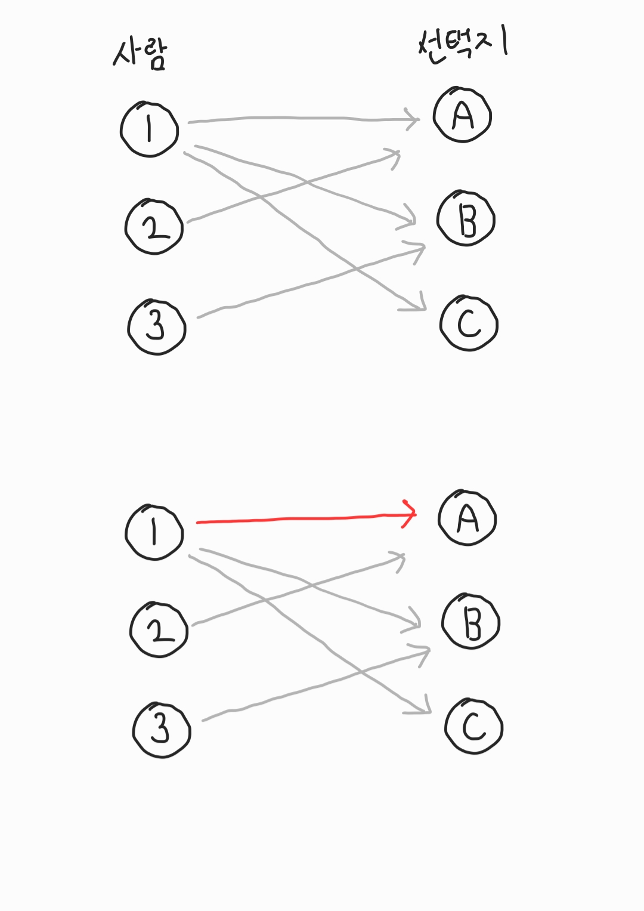
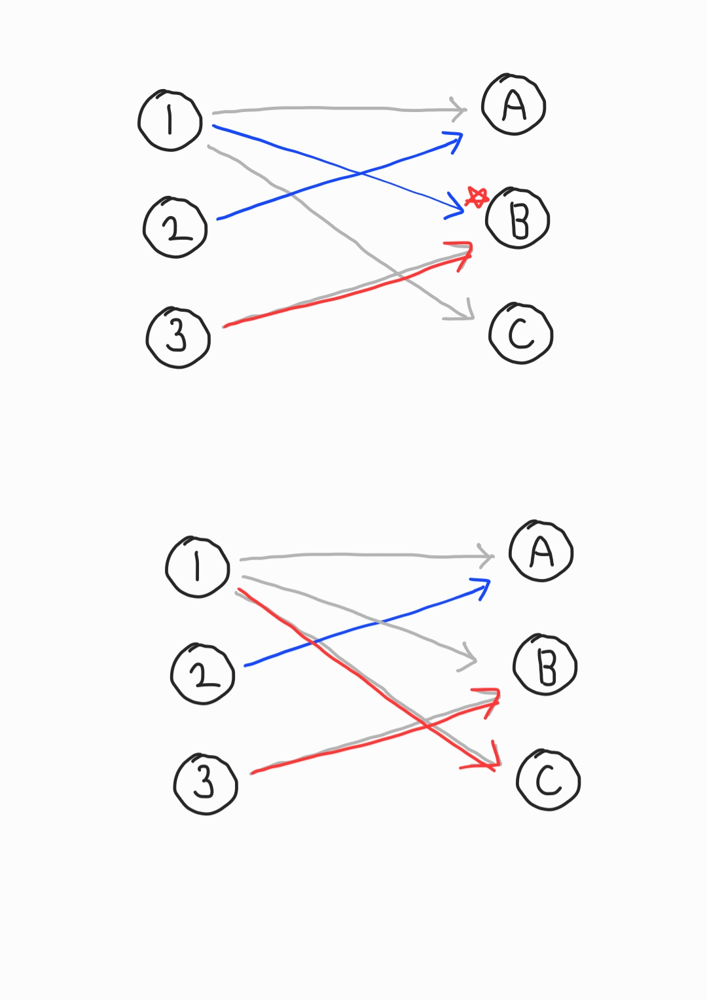
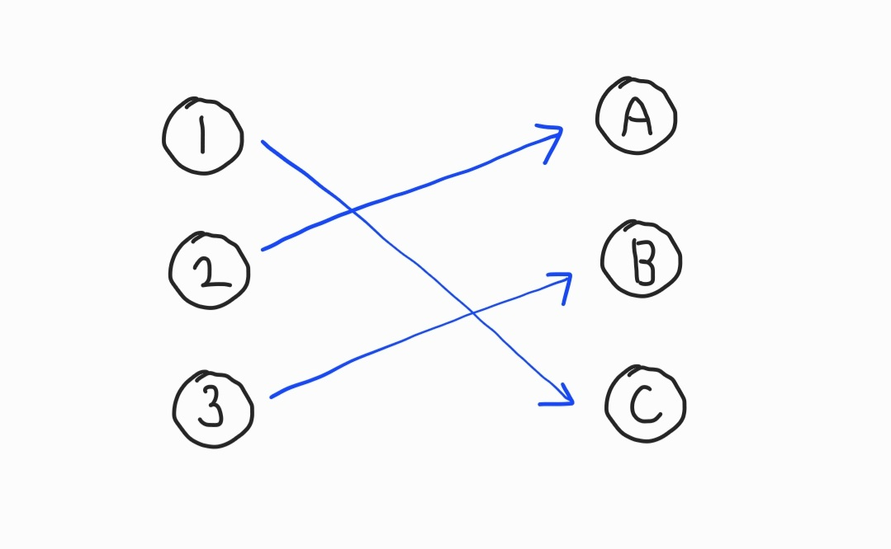

# Bipartite-matching(이분매칭)

- 네트워크 플로우 알고리즘과 연계되는 개념으로, A 집단이 B 집단을 선택하는 방법에 대한 알고리즘

- 한 집단이 다른 한 집단을 선택할 때, 효과적으로 매칭하는 경우(최대로 매칭시킬 수 있는 경우)를 찾는다.

## DFS를 이용한 알고리즘

```
사람 1은 A, B, C를 선택할 수 있다.

사람 2는 A를 선택할 수 있다.

사람 3은 B를 선택할 수 있다.

이 때, 가장 효과적으로 매칭시킬 수 있는 경우는?
```



- 1의 가능한 선택지인 A에 매칭시킨다.


- 2의 가능한 선택지인 A에 매칭시킨다.
- 2의 가능한 선택지는 A밖에 없고, 이미 1이 A에 점유를 하고 있으므로 1의 가능한 선택지가 더 있는지 찾은 후 1을 B에 매칭시킨다.



- 3의 가능한 선택지인 B에 매칭시킨다.
- 3의 가능한 선택지는 B밖에 없고, 이미 1이 B에 점유를 하고 있으므로 1의 가능한 선택지가 더 있는지 찾은 후 1을 C에 매칭시킨다.



- 매칭완료

## python

```python
# 사람 n명, 공간 m개
n, m = 3, 3
graph = {
    1: [1, 2, 3],
    2: [1],
    3: [2]
}

######################################
result = [0] * (m + 1)

def dfs(v, visited):
    for node in graph[v]:
        if visited[node]:
            continue
        visited[node] = True
        # 아직 집이 비어있거나,
        # 비어있지 않다면 현재 점유하고 있는 노드가 방문할 수 있는 집을 찾는다.
        if not result[node] or dfs(result[node], visited):
            result[node] = v
            return True
    return False

count = 0
for v in range(1, n + 1):
    visited = [False] * (m + 1)
    if dfs(v, visited):
        count += 1

print(f"{count} 개의 매칭이 이루어졌습니다.")

for i in range(1, m + 1):
    if result[i]:
        print(f"{result[i]} 번 사람이 {i}에 위치합니다.")

"""
3 개의 매칭이 이루어졌습니다.
2 번 사람이 1에 위치합니다.
3 번 사람이 2에 위치합니다.
1 번 사람이 3에 위치합니다.
"""
```
