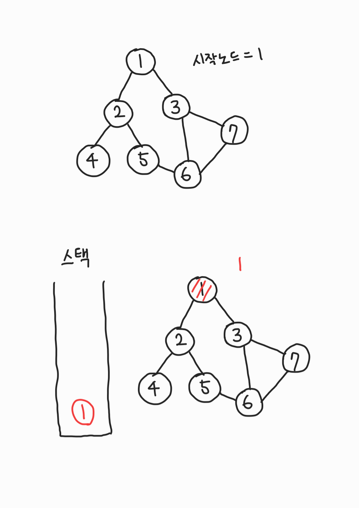
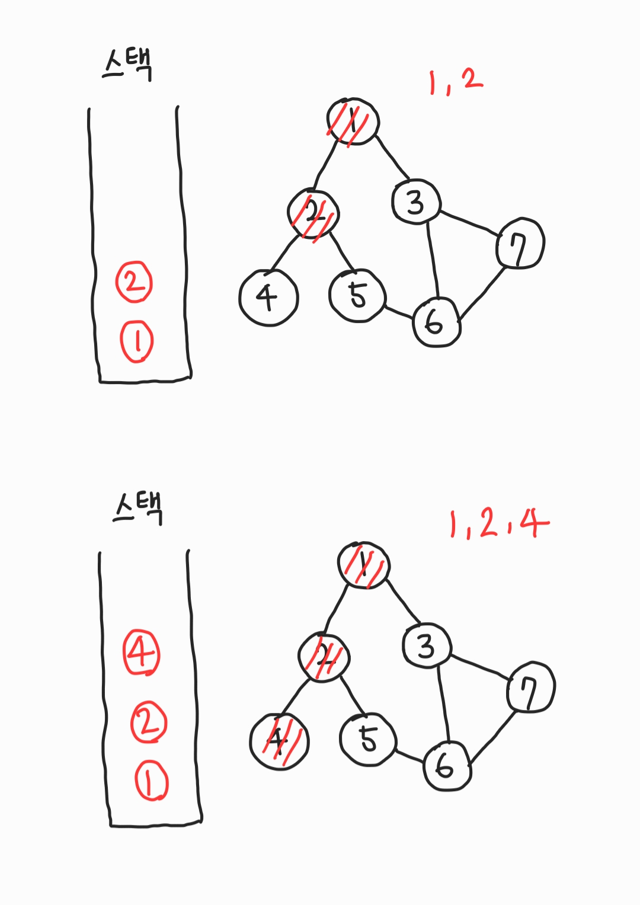
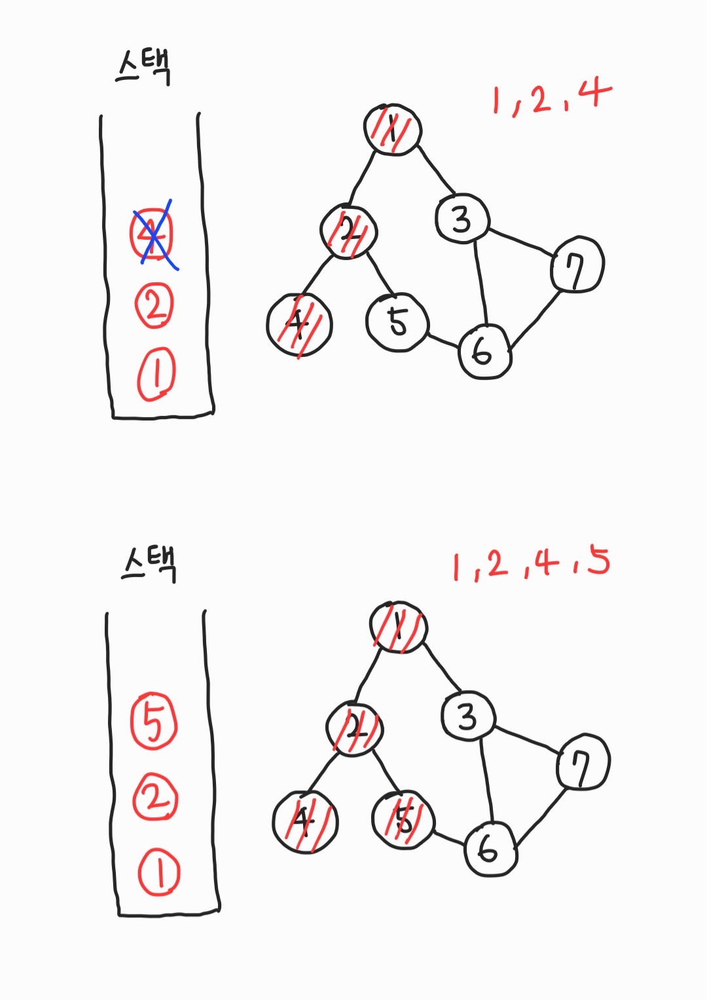
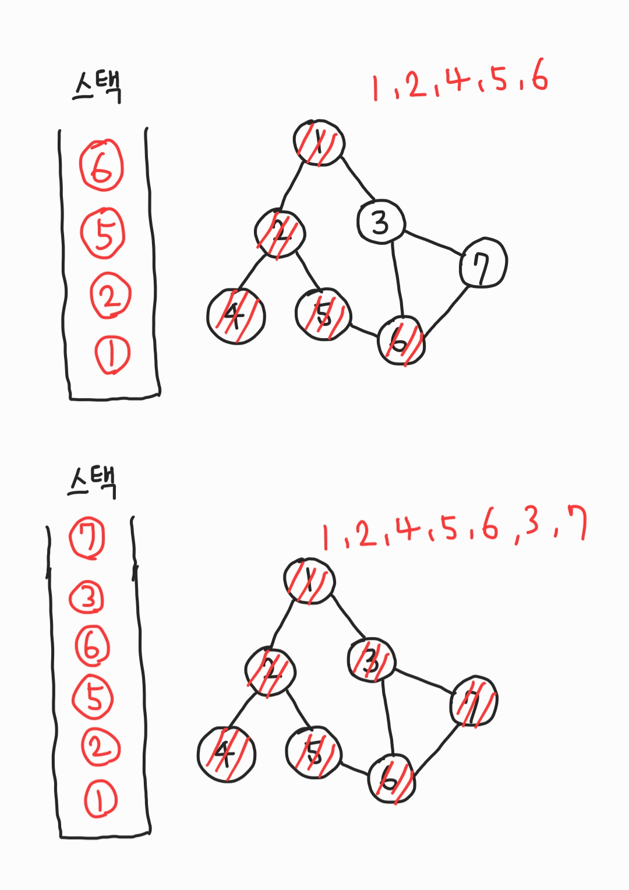
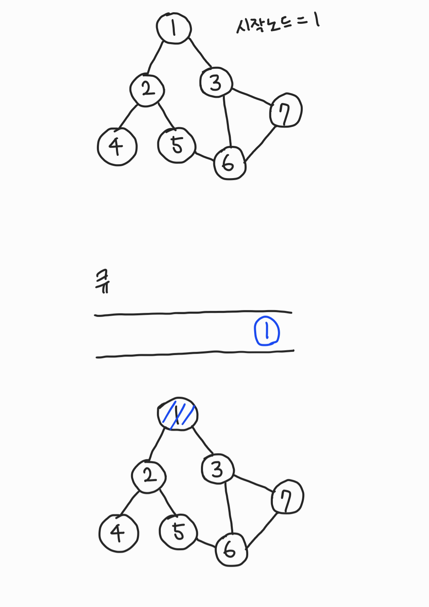
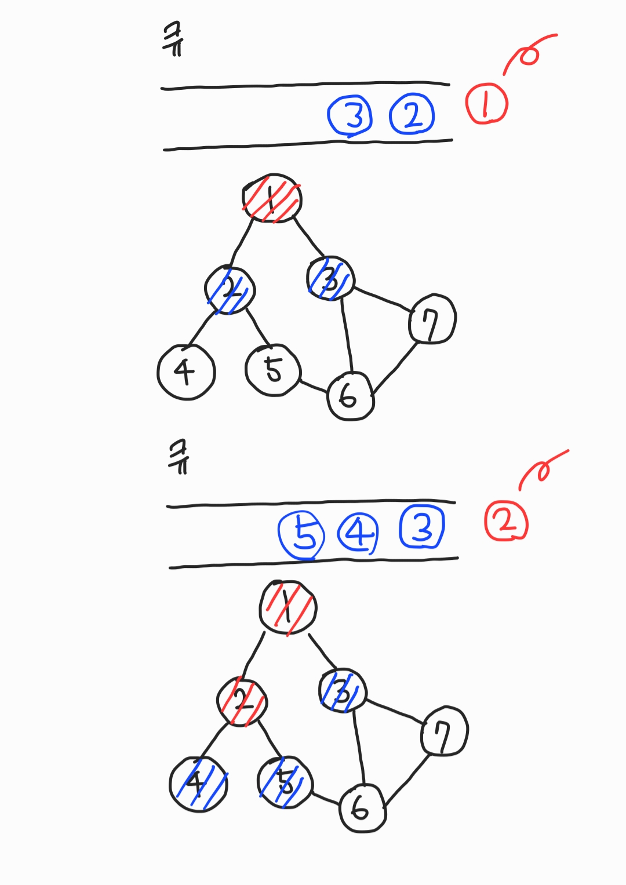
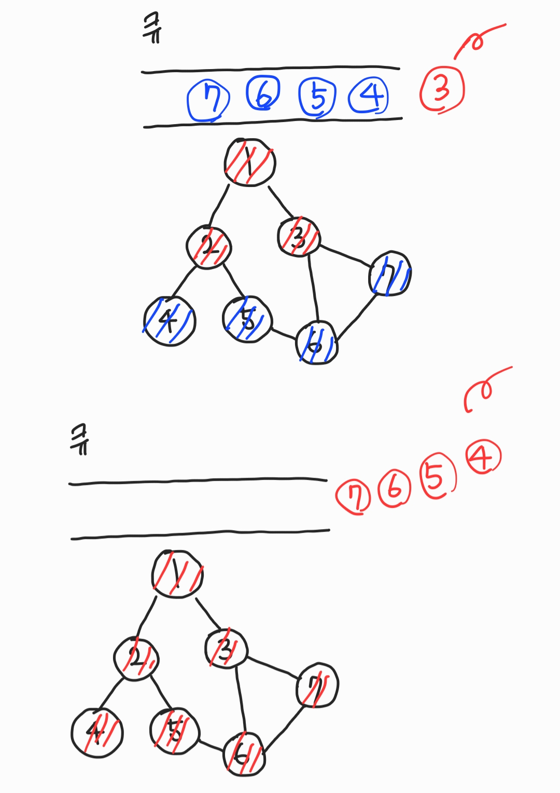

# DFS

그래프와 스택 또는 재귀로 구현한다.






## C

```c
#include <iostream>
#include <vector>

using namespace std;

int number = 7;
int c[8];
vector <int> a[8];

void dfs(int x){
	if(c[x]) return;
	c[x] = true;
	cout << x << " ";
	for(int i=0; i < a[x].size(); i++){
		int y = a[x][i];
		dfs(y);
	}
}

int main(void){
	// 1-2
	a[1].push_back(2);
	a[2].push_back(1);

	// 1-3
	a[1].push_back(3);
	a[3].push_back(1);

	// 2-4
	a[2].push_back(4);
	a[4].push_back(2);

	// 2-5
	a[2].push_back(5);
	a[5].push_back(2);

	// 3-6
	a[3].push_back(6);
	a[6].push_back(3);

	// 3-7
	a[3].push_back(7);
	a[7].push_back(3);

	// 5-6
	a[5].push_back(6);
	a[6].push_back(5);

	// 6-7
	a[6].push_back(7);
	a[7].push_back(6);

	dfs(1);
	return 0;
}

// 1 2 4 5 6 3 7
```

## python

```python
graph = {
    1: [2, 3, 4],
    2: [5],
    3: [5],
    4: [],
    5: [6, 7],
    6: [],
    7: [3]
}

def recursive_dfs(v, discovered = []):
    discovered.append(v)
    for w in graph[v]:
        if w not in discovered:
            discovered = recursive_dfs(w, discovered)
    return discovered

#print(recursive_dfs(1))
#[1, 2, 5, 6, 7, 3, 4]

def iterative_dfs(start_v):
    discovered = []
    stack = [start_v]
    while stack:
        v = stack.pop()
        if v not in discovered:
            discovered.append(v)
            for w in graph[v]:
                stack.append(w)
    return discovered

#print(iterative_dfs(1))
#[1, 4, 3, 5, 7, 6, 2]
```

# BFS(Breath First Search, 너비우선탐색)

그래프와 Queue로 구현한다.

그때마다 가장 짧은 경로를 찾는 점에서, 그리디 유형의 알고리즘이라고 할 수 있음.





## C

```c
#include <iostream>
#include <queue>
#include <vector>

using namespace std;

int number = 7;
//check visit
int c[8];
vector<int> a[8];

void bfs(int start){
	queue<int> q;
	q.push(start);
	c[start] = true;
	while(!q.empty()){
		int x = q.front();
		q.pop();
		printf("%d ", x);
		for(int i=0; i < a[x].size(); i++){
			int y = a[x][i];
			if(!c[y]){
				q.push(y);
				c[y] = true;
			}
		}
	}
}

int main(void){
	// 1-2
	a[1].push_back(2);
	a[2].push_back(1);

	// 1-3
	a[1].push_back(3);
	a[3].push_back(1);

	// 2-4
	a[2].push_back(4);
	a[4].push_back(2);

	// 2-5
	a[2].push_back(5);
	a[5].push_back(2);

	// 3-6
	a[3].push_back(6);
	a[6].push_back(3);

	// 3-7
	a[3].push_back(7);
	a[7].push_back(3);

	// 5-6
	a[5].push_back(6);
	a[6].push_back(5);

	// 6-7
	a[6].push_back(7);
	a[7].push_back(6);

	bfs(1);
	return 0;
}

// 1 2 3 4 5 6 7
```

## python

```python
import collections

graph = {
    1: [2, 3, 4],
    2: [5],
    3: [5],
    4: [],
    5: [6, 7],
    6: [],
    7: [3]
}

def iterative_bfs(start_v):
    discovered = [start_v]
    q = collections.deque()
    q.append(start_v)
    while q:
        v = q.popleft()
        for w in graph[v]:
            if w not in discovered:
                discovered.append(w)
                q.append(w)
    return discovered

print(iterative_bfs(1))
#[1, 2, 3, 4, 5, 6, 7]
```

---

## DFS 모든경로탐색

사이클이 없는 유향 그래프에서 한 노드에서 다른 노드로 가는 모든 경로 탐색

```python
from collections import deque, defaultdict
# when all node is connected, from start to end
# graph is dictionary
stack = deque()
paths = []
def dfs_all(v:int, goal:int):
    visited[v] = True
    stack.append(v)
    if v == goal:
        path = []
        for i in dq:
            path.append(i)
        paths.append(path)
        stack.pop()
        return
    for node, cost in graph[v]:
        if node and not visited[node]:
            dfs_all(node, goal)
            visited[node] = False
    stack.pop()
```
