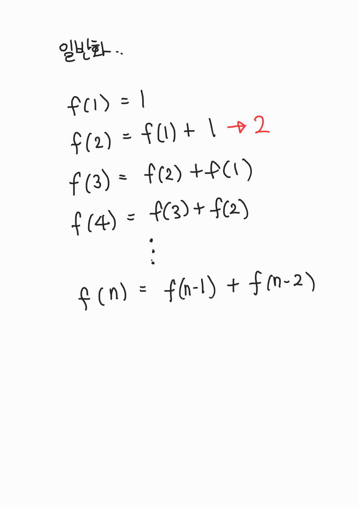

# Dynamic Programming(DP)

> 동적계획법, "큰 문제를 작은 문제로 나눈다"

- 한번 해결한 문제는 다시 해결하지 않는다. (하나의 문제는 한 번만 해결한다)

- 큰 문제를 작은 문제로 나누기 위한 "규칙성"을 찾아본다.

- "메모이제이션" 기법을 사용한다. (메모이제이션 기법은 프론트엔드에서도 최적화를 위해 사용하는 기법)

## DP를 사용할 수 있을 때

1. 큰 문제를 작은 문제로 나눌 수 있다.
2. 작은 문제에서 해결하는 로직이 큰 문제에서도 동일하다.

# 피보나치 수열로 보는 DP

`1 1 2 3 5 8 13 21 34 55 ...` 와 같은 피보나치 수열은

`f(n) = f(n-1) + f(n-2)` 라고 재귀적으로 쉽게 정의할 수 있다.


하지만 그림처럼 반복 되는 연산을 계속해서 수행하는데, 연산의 수행횟수는 **지수적으로 증가**하여 극악의 시간복잡도를 이룬다..

하지만 메모이제이션 기법을 사용하면 O(n)의 시간복잡도로 최적화를 이룰 수 있다. (동적계획법의 시간복잡도가 O(n)이라는 것은 아니다.)

## C

```c
# include <stdio.h>

int d[101];

int fib(int x){
	if(x==1) return 1;
	if(x==2) return 1;
	// if there
	if(d[x] != 0 ) return d[x];
	return d[x] = fib(x-1) + fib(x-2);
}

int main(void){
	printf("%d", fib(30));
}

// 832040
```

# [2xn 타일링](https://www.acmicpc.net/problem/11726)

> 2×n 크기의 직사각형을 1×2, 2×1 타일로 채우는 방법의 수를 구하는 프로그램을 작성하시오




## C

```c
#include <stdio.h>

int d[1001];

int dp(int x){
	if(x==1) return 1;
	if(x==2) return 2;
	if(d[x] != 0) return d[x];
	return d[x] = (dp(x-1) + dp(x-2)) % 10007;
}

int main(void) {
	int x;
	scanf("%d", &x);
	printf("%d", dp(x));
}
```

## 다른문제

[2xn 타일링 2](https://www.acmicpc.net/problem/11727)

[타일 채우기](https://www.acmicpc.net/problem/2133)

[타일 채우기 3](https://www.acmicpc.net/problem/14852)

---

# 배낭 문제 (Knapsack Problem)

```python
cargo = [
    # (단가, kg)
    (4, 12),
    (2, 1),
    (10, 4),
    (1, 1),
    (2, 2)
]

def zero_one_knapsack(cargo):
    capacity = 15
    pack = []

    for i in range(len(cargo) + 1):
        pack.append([])
        for c in range(capacity + 1):
            if i == 0 or c == 0:
                pack[i].append(0)
            elif cargo[i - 1][1] <= c:
                pack[i].append(
                    max(
                        cargo[i - 1][0] + pack[i - 1][c - cargo[i - 1][1]],
                        pack[i - 1][c]
                    ))
            else:
                pack[i].append(pack[i - 1][c])

    return pack

result = zero_one_knapsack(cargo)

for i in result:
    print(i)

"""
[0, 0, 0, 0, 0, 0, 0, 0, 0, 0, 0, 0, 0, 0, 0, 0]
[0, 0, 0, 0, 0, 0, 0, 0, 0, 0, 0, 0, 4, 4, 4, 4]
[0, 2, 2, 2, 2, 2, 2, 2, 2, 2, 2, 2, 4, 6, 6, 6]
[0, 2, 2, 2, 10, 12, 12, 12, 12, 12, 12, 12, 12, 12, 12, 12]
[0, 2, 3, 3, 10, 12, 13, 13, 13, 13, 13, 13, 13, 13, 13, 13]
[0, 2, 3, 4, 10, 12, 13, 14, 15, 15, 15, 15, 15, 15, 15, 15]
"""
```
