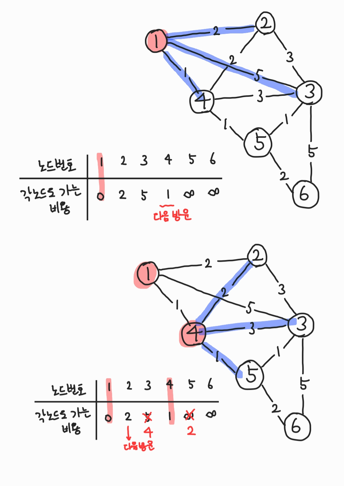
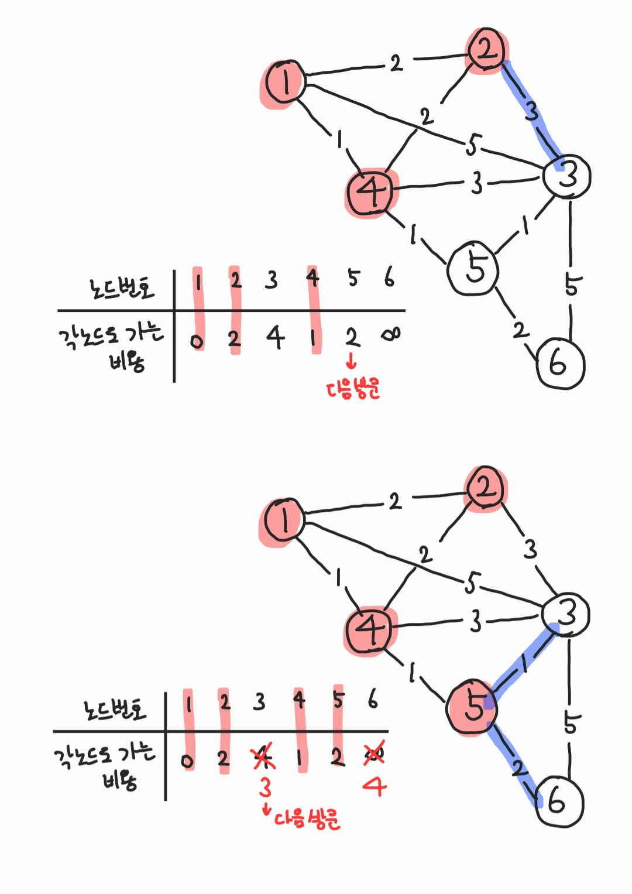
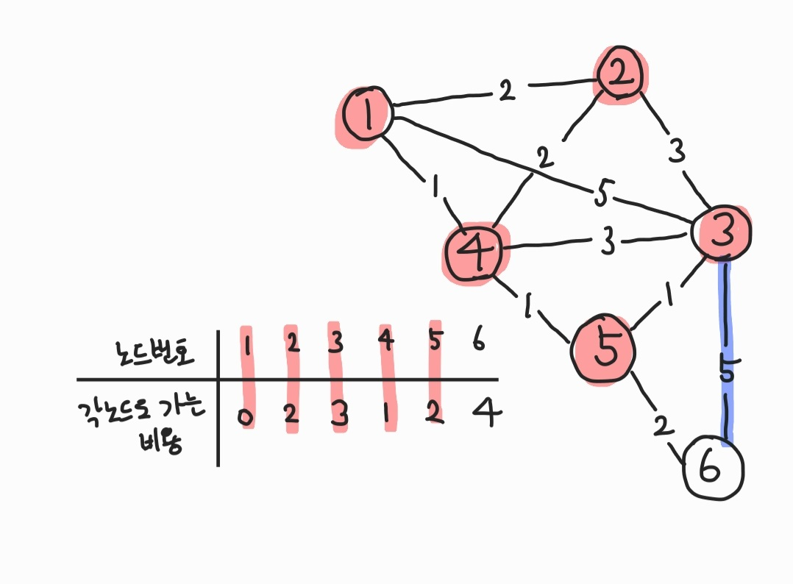

# 다익스트라

- 한 노드에서 다른 노드로 가는 경로를 찾는다. 즉 최단거리를 찾을 수 있고, 기준이 한 개의 노드이기 때문에 보통 1차원 배열안에서 구현한다.

- 일종의 greedy + bfs 알고리즘과 다이나믹 프로그래밍 알고리즘의 한 유형
  - 최단거리는 여러개의 최단 거리로 이루어져 있다고 생각할 수 있기 때문.

## 예시

출발노드가 1이라고 했을 때,



1. 노드 1에서 갈 수 있는 경로를 찾고 가장 저렴한 노드 4를 방문한다.

2. 노드 4에서 갈 수 있는 경로를 찾고 각 노드로 갈 수 있는 비용이 더 적다면 새로 갱신한다. 그리고 가장 저렴한 노드 2를 방문한다.



1. 노드 2에서 갱신할 노드는 없다.

2. 다시 노드 4로 가서 다음으로 저렴한 노드 5를 방문한다. 노드 5에서 갈 수 있는 경로를 찾고 각 노드로 갈 수 있는 비용이 더 적다면 새로 갱신한다. 그리고 가장 저렴한 노드 3을 방문한다.



1. 노드 6에서 갱신할 노드는 없다. 프로그램을 종료한다.

---

# 선형탐색

## C

선형적으로 탐색하여 아래와 같이 표현할 수 있지만 시간복잡도가 O(N)으로 정점의 갯수가 많은데 간선의 갯수가 적을 때 매우 비효율적으로 동작할 수 있다.

```c
#include <stdio.h>

int number = 6;
int INF = 987654321;

// node
int a[6][6] = {
	{ 0, 2, 5, 1, INF, INF },
	{ 2, 0, 3, 2, INF, INF },
	{ 5, 3, 0, 3, 1, 5 },
	{ 1, 2, 3, 0, 1, INF },
	{ INF, INF, 1, 1, 0, 2 },
	{ INF, INF, 5, INF, 2, 0 },
};
//check visited
bool v[6];

//distance
int d[6];

int getSmallIndex(){
	int min = INF;
	int index = 0;
	for(int i=0; i<number; i++){
		if(d[i] < min && !v[i]){
			min = d[i];
			index = i;
		}
	}
	return index;
}

void dijkstra(int start){
	for(int i=0; i<number; i++){
		d[i] = a[start][i];
	}
	v[start] = true;
	for(int i=0; i<number-2; i++){
		int current = getSmallIndex();
		v[current] = true;
		for(int j=0; j<6; j++){
			if(!v[j]){
				if( d[current] + a[current][j] < d[j] ){
					d[j] = d[current] + a[current][j];
				}
			}
		}
	}
}

int main(void){
	dijkstra(0);
	for(int i=0; i<number; i++){
		printf("%d ", d[i]);
	}
}

// 0 2 3 1 2 4
```

## python

```python
INF = int(1e9)

# node num
n = 6
# edge num
m = 11

# node info
graph = [
    [],
    [(2, 2), (3, 5), (4, 1)],
    [(1, 2), (3, 3), (4, 2)],
    [(1, 5), (2, 3), (4, 3), (5, 1), (6, 5)],
    [(1, 1), (2, 2), (3, 3), (5, 1)],
    [(3, 1), (4, 1), (6, 2)],
    [(3, 5), (5, 2)]
]

# check visited
visited = [False] * (n + 1)

# distance
distance = [INF] * (n + 1)

def get_small_index()->int:
    min_value = INF
    index = 0
    for i in range(1, n+1):
        if distance[i] < min_value and not visited[i]:
            min_value = distance[i]
            index = i
    return index

def dijkstra(start:int):
    distance[start] = 0
    visited[start] = True
    for node, d in graph[start]:
        distance[node] = d

    for i in range(n-1):
        now = get_small_index()
        visited[now] = True
        for node, d in graph[now]:
            cost = distance[now] + d
            if cost < distance[node]:
                distance[node] = cost

dijkstra(1)

print(distance[1:])
# [0, 2, 3, 1, 2, 4]
```

# 우선순위 큐 방식

인접리스트 방식의 queue를 사용하게 되면 O(NlogN)으로 단축시킬 수 있다.

## C

```c++
#include <iostream>
#include <vector>
#include <queue>

using namespace std;

int number = 6;
int INF = 987654321;

// node
vector<pair<int, int> > a[7];

//distance
int d[7];

void dijkstra(int start){
	d[start] = 0;
	// heap
	priority_queue<pair<int, int> > pq;
	pq.push(make_pair(start, 0));

	// use queue
	while(!pq.empty()){
		int current = pq.top().first;
		int distance = -pq.top().second;
		pq.pop();

		//skip if not the shortest distance
		if( d[current] < distance ) continue;
		for(int i=0; i< a[current].size(); i++ ){
			int next = a[current][i].first;
			int nextDistance = distance + a[current][i].second;
			if( nextDistance < d[next] ){
				d[next] = nextDistance;
				pq.push(make_pair(next, -nextDistance));
			}
		}
	}
}

int main(void){
	for(int i=1; i<=number; i++){
		d[i] = INF;
	}

	a[1].push_back(make_pair(2,2));
	a[1].push_back(make_pair(3,5));
	a[1].push_back(make_pair(4,1));

	a[2].push_back(make_pair(1,2));
	a[2].push_back(make_pair(3,3));
	a[2].push_back(make_pair(4,2));

	a[3].push_back(make_pair(1,5));
	a[3].push_back(make_pair(2,3));
	a[3].push_back(make_pair(4,3));
	a[3].push_back(make_pair(5,1));
	a[3].push_back(make_pair(6,5));

	a[4].push_back(make_pair(1,1));
	a[4].push_back(make_pair(2,2));
	a[4].push_back(make_pair(3,3));
	a[4].push_back(make_pair(5,1));

	a[5].push_back(make_pair(3,1));
	a[5].push_back(make_pair(4,1));
	a[5].push_back(make_pair(6,2));

	a[6].push_back(make_pair(3,5));
	a[6].push_back(make_pair(5,2));

	dijkstra(1);

	for(int i=1; i<=number; i++){
		printf("%d ", d[i]);
	}

}
```
