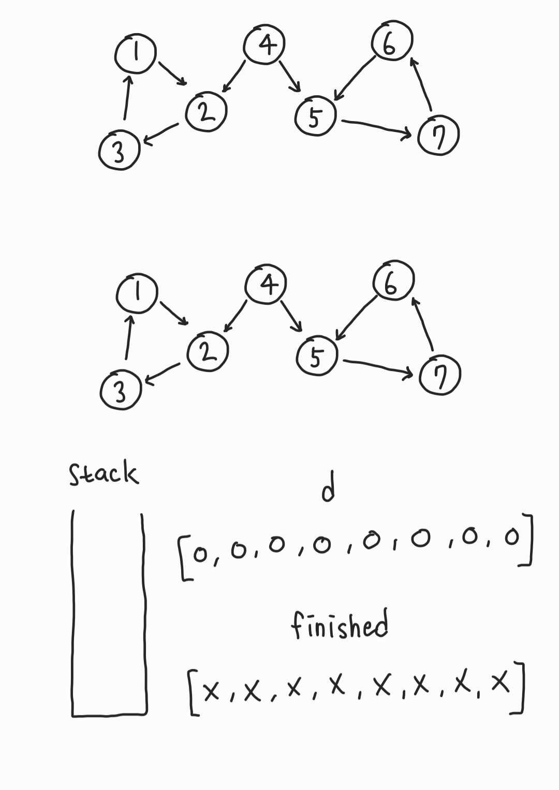
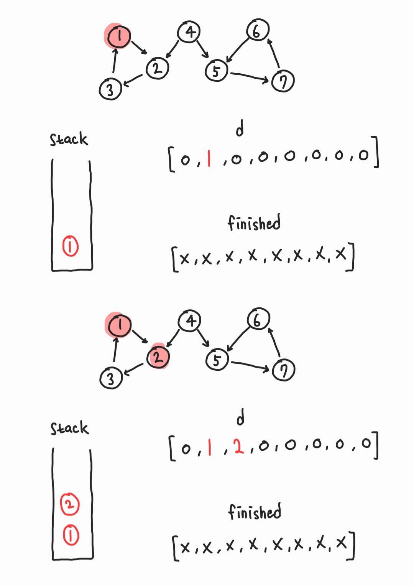
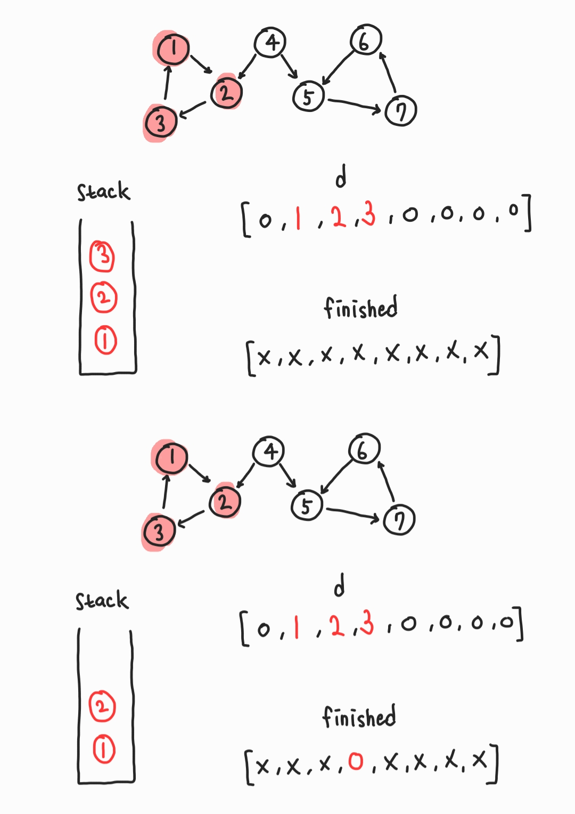
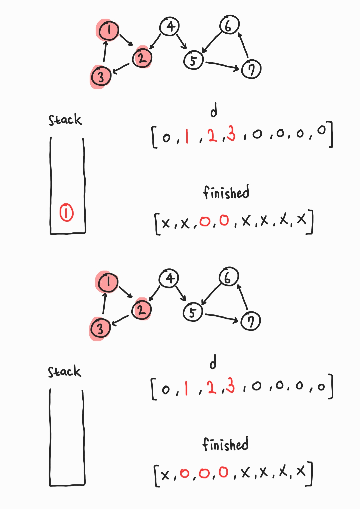
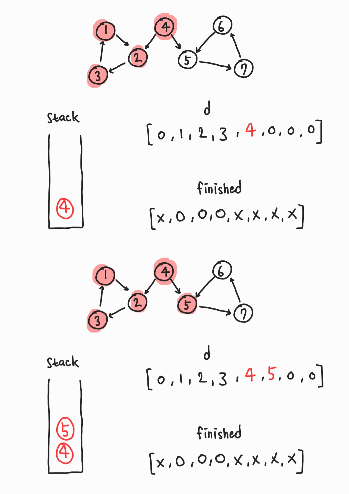
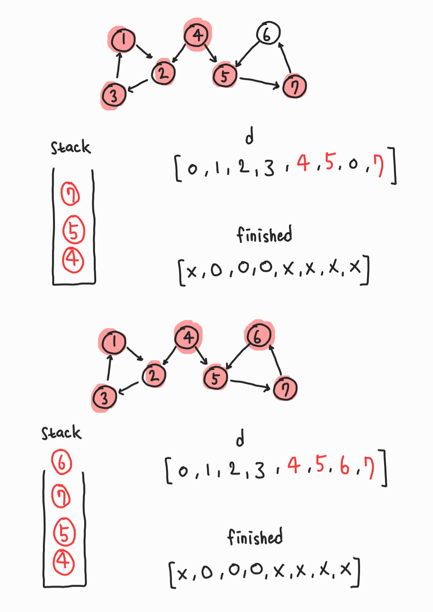
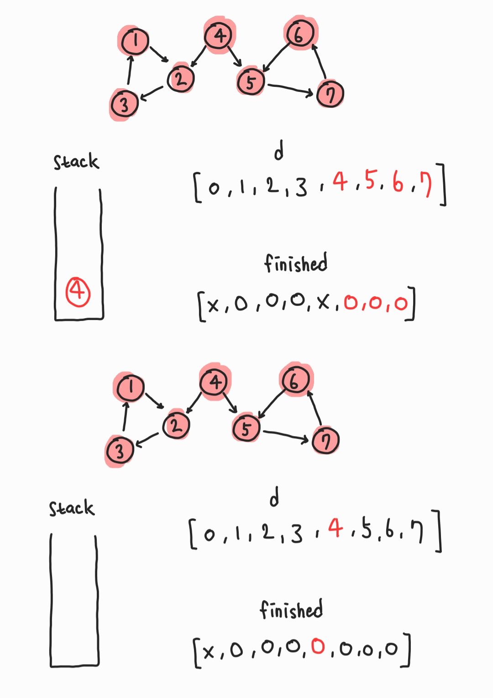

# Strongly Connected Component(SCC), 강한결합요소

- 유향그래프 상에서 한 정점이 다른 정점으로 도달할 수 있는 정점들의 집합을 의미한다.

- 따라서 무향그래프에서는 모든 정점이 SCC이기 때문에 유향그래프에서만 의미가 있음.

- 따라서 사이클이 발생하는 경우 무조건 SCC라고 할 수 있음.

- 한 유향그래프에서 SCC를 추출하는 대표적인 알고리즘 2가지 : **코사라주 알고리즘**, **타잔 알고리즘**

- 스택과 DFS로 구현한다.

# Tarjan's Algorithm

모든 정점에 대해 DFS를 수행한다.






- 정점 1, 2, 3에 대해 scc-1이 생성되었음.





- 정점 5, 6, 7에 대해 scc-2가 생성되었음.

- 정점 4에 대해 scc-3이 생성되었음.

따라서 크게보면 scc-1, scc-2, scc-3에 대한 새로운 그래프가 형성되었다고 볼 수 있다.

# python

```python
from collections import deque
import sys
input = lambda: sys.stdin.readline().rstrip()
sys.setrecursionlimit(10**6)

n = 11
graph = {
    1: [2],
    2: [3],
    3: [1],
    4: [2, 5],
    5: [7],
    6: [5],
    7: [6],
    8: [5, 9],
    9: [10],
    10: [11],
    11: [3, 8],
}

stack = deque()
parents = [0] * (n + 1)
visited = [False] * (n + 1)
result_SCC = []

def dfs(v):
    parents[v] = v
    stack.append(v)
    parent = parents[v]
    for node in graph[v]:
        if parents[node] == 0:
            parent = min(parent, dfs(node))
        elif not visited[node]:
            parent = min(parent, parents[node])

    if parent == parents[v]:
        scc = []
        while True:
            x = stack.pop()
            scc.append(x)
            visited[x] = True
            if x == v:
                break
        result_SCC.append(scc)
    return parent

for v in range(1, n + 1):
    if parents[v] == 0:
        dfs(v)

print(stack)
print(parents)
print(visited)
print(result_SCC)
"""
deque([])
[0, 1, 2, 3, 4, 5, 6, 7, 8, 9, 10, 11]
[False, True, True, True, True, True, True, True, True, True, True, True]
[[3, 2, 1], [6, 7, 5], [4], [11, 10, 9, 8]]
"""
```
