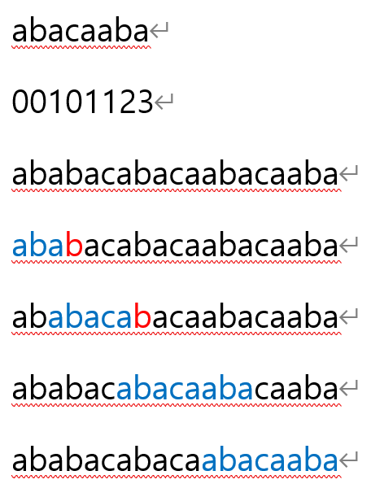

# String-matching(문자열 매칭)

- 어떤 문자열에서 특정한 문자열을 찾는 알고리즘

## 매우 다양한 문자열 매칭 알고리즘을 설명해주는 웹사이트

[http://www-igm.univ-mlv.fr/~lecroq/string/index.html](http://www-igm.univ-mlv.fr/~lecroq/string/index.html)

# 브루트포스로 찾기

- 가장 단순한 방식으로 특정한 문자열의 인덱스를 하나씩 늘리면서 찾는다.

## python

```python
def find_string(parent:str, pattern:str)->bool:
    parent_size = len(parent)
    pattern_size = len(pattern)
    for i in range(0, parent_size - pattern_size + 1):
        found = True
        for j in range(0, pattern_size):
            if parent[i+j] != pattern[j]:
                found = False
                break
        if found:
            return i
    return False

parent = "Hello World"
pattern = "llo W"
result = find_string(parent, pattern)

print(f"{result} is found") if result else print("not found..")

# 2 is found
```

# KMP(Knuth-Morris-Pratt)

- 접두사와 접미사를 활용하여 이미 찾은 문자열의 일정 부분은 건너뛴다!



```python
def make_table(pattern:str)->list:
    pattern_size = len(pattern)
    table = [0] * pattern_size
    j = 0
    for i in range(1, pattern_size):
        while j > 0 and pattern[i] != pattern[j]:
            j = table[j - 1]
        if pattern[i] == pattern[j]:
            j += 1
            table[i] = j
    return table

print(make_table("abacaaba"))
# [0, 0, 1, 0, 1, 1, 2, 3]

def kmp(parent:str, pattern:str)->list:
    result = []
    table = make_table(pattern)
    parent_size = len(parent)
    pattern_size = len(pattern)
    j = 0
    for i in range(0, parent_size):
        while j > 0 and parent[i] != pattern[j]:
            j = table[j-1]

        if parent[i] == pattern[j]:
            if j == (pattern_size - 1):
                result.append(i - pattern_size + 2)
                j = table[j]
            else:
                j += 1

    return result

result = kmp("ababacabacaabacaaba", "abacaaba")

print(result)
# [7, 12]
```

# Rabin-Karp(라빈-카프)

- 문자열의 해시값을 이용하여 찾는다. (해시특성상 충돌이 발생할 수 있음..)

```python
def find_string(parent:str, pattern:str)->list:
    result = []
    parent_size = len(parent)
    pattern_size = len(pattern)
    parent_hash = 0
    pattern_hash = 0
    power = 1
    for i in range(0, parent_size - pattern_size + 1):
        if i == 0:
            # init
            for j in range(0, pattern_size):
                parent_hash += ord(parent[pattern_size-1-j]) * power
                pattern_hash += ord(pattern[pattern_size-1-j]) * power
                if j < pattern_size - 1:
                    power *= 2
        else:
            parent_hash = 2 * (parent_hash - ord(parent[i-1]) * power) + ord(parent[pattern_size - 1 + i])

        if parent_hash == pattern_hash:
            found = True
            for j in range(0, pattern_size):
                if parent[i + j] != pattern[j]:
                    found = False
                    break
            if found:
                result.append(i + 1)

    return result


result = find_string("ababacabacaabacaaba", "abacaaba")

print(result)
# [7, 12]
```
