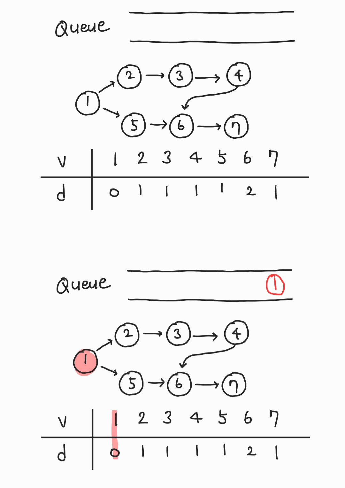

# Topology sort

- 순서가 정해져 있는 작업을 차례로 수행해야 할 때 사용하는 알고리즘

- 사이클이 발생하지 않는 유향 그래프에서 수행되어야 한다.

- 큐나 스택으로 구현한다.

# 예시




# python

```python
from collections import deque

graph = {
    1: [2, 5],
    2: [3],
    3: [4],
    4: [6],
    5: [6],
    6: [7],
    7: []
}
n = len(graph)

def topology_sort(n:int, graph:dict)->list:
    INF = 987654321
    result = []
    degree = [INF] + [0 for _ in range(n)]
    q = deque()

    # insert degree info in list
    for nodes in graph.values():
        for node in nodes:
            degree[node] += 1

    for i in range(1, n+1):
        if degree[i] == 0:
            q.append(i)

    for _ in range(n):
        if len(q) == 0:
            print("occur cycle..")
            return
        x = q.popleft()
        result.append(x)
        for node in graph[x]:
            degree[node] -= 1
            if degree[node] == 0:
                q.append(node)

    return result

print(topology_sort(n, graph))
# [1, 2, 5, 3, 4, 6, 7]
```
