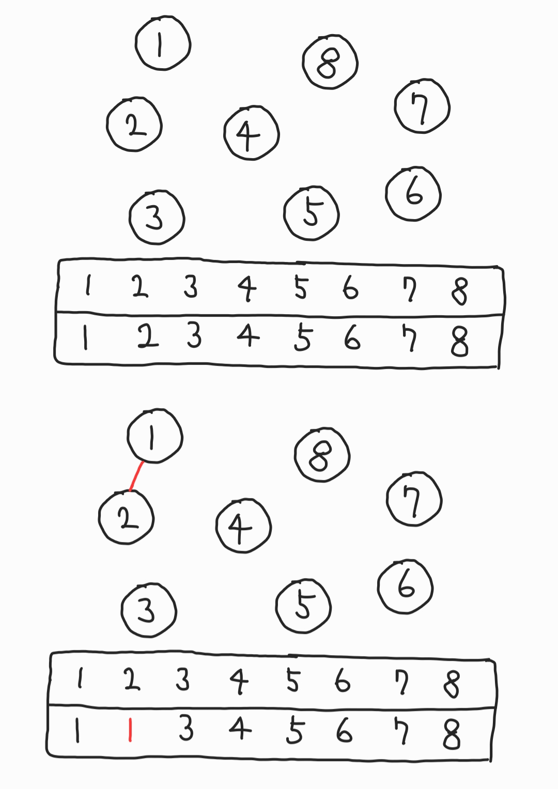
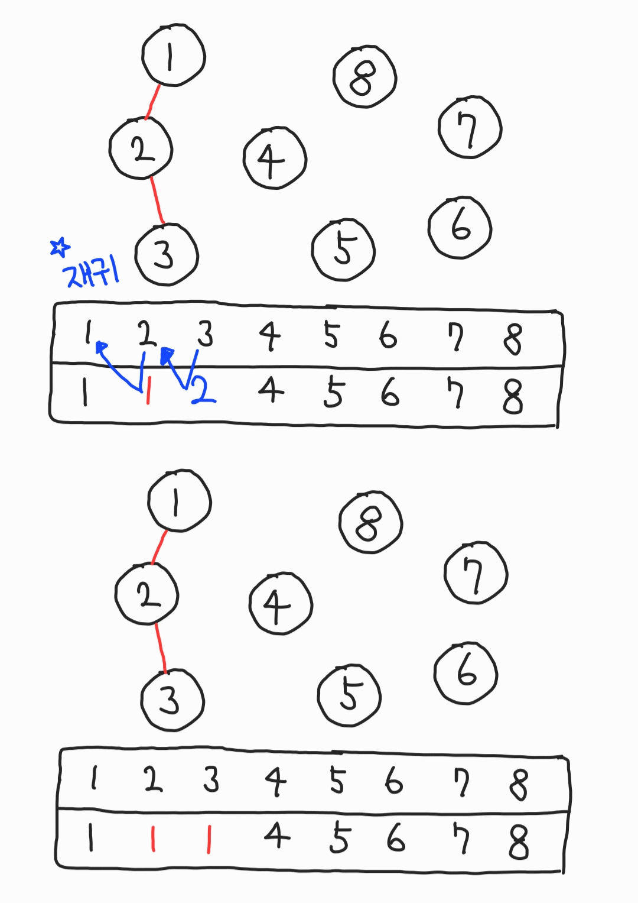

# Union-Find

<strong>그래프 기반의 알고리즘</strong>

- 합집합 찾기, 서로소 집합(Disjoint-Set) 알고리즘이라고도 한다.

- 여러개의 노드가 존재할 때, 두 노드가 같은 노드인지(연결되어있는지) 판별하는 알고리즘

- 최단경로, 최소비용 등 경로를 찾아야 하는 길찾기 알고리즘과 연결된다.

## 예시

<표>에서 각 노드들은 부모노드를 가리킨다.




## C

```c
# include <stdio.h>

int getParent(int parent[], int x){
	if(parent[x] == x) return x;
	return parent[x] = getParent(parent, parent[x]);
}

void unionParent(int parent[], int a, int b){
	a = getParent(parent, a);
	b = getParent(parent, b);
	if(a<b) parent[b] = a;
	else parent[a] = b;
}

int findParent(int parent[], int a, int b){
	a = getParent(parent, a);
	b = getParent(parent, b);
	if (a==b) return 1;
	else return 0;
}

int main(void) {
	int parent[11];
	for(int i=1; i<=10; i++){
		parent[i] = i;
	}

	unionParent(parent, 1,2);
	unionParent(parent, 2,3);
	unionParent(parent, 3,4);
	unionParent(parent, 5,6);
	unionParent(parent, 6,7);
	unionParent(parent, 7,8);
	printf("1 and 5 ? %d\n", findParent(parent, 1, 5));
	// 0
	unionParent(parent, 1, 5);
	printf("1 and 5 ? %d\n", findParent(parent, 1, 5));
	// 1
}
```

## python

```python
def find_parent(parent:list, x:int)->int:
    if parent[x] != x:
        parent[x] = find_parent(parent, parent[x])
    return parent[x]

def union_parent(parent:list, a:int, b:int):
    a = find_parent(parent, a)
    b = find_parent(parent, b)
    if a < b:
        parent[b] = a
    else:
        parent[a] = b

def check_cycle(parent:list, a:int, b:int)->bool:
    a = find_parent(parent, a)
    b = find_parent(parent, b)
    if a == b:
        return True
    else:
        return False

# node num
n = 8

# node init as index
parent = [x for x in range(n+1)]

union_parent(parent, 1, 2)
union_parent(parent, 2, 3)
union_parent(parent, 3, 4)
union_parent(parent, 5, 6)
union_parent(parent, 6, 7)
union_parent(parent, 7, 8)

print(parent[1:])
# [1, 1, 1, 1, 5, 5, 5, 5]

print(check_cycle(parent, 1, 5))
# False
```
