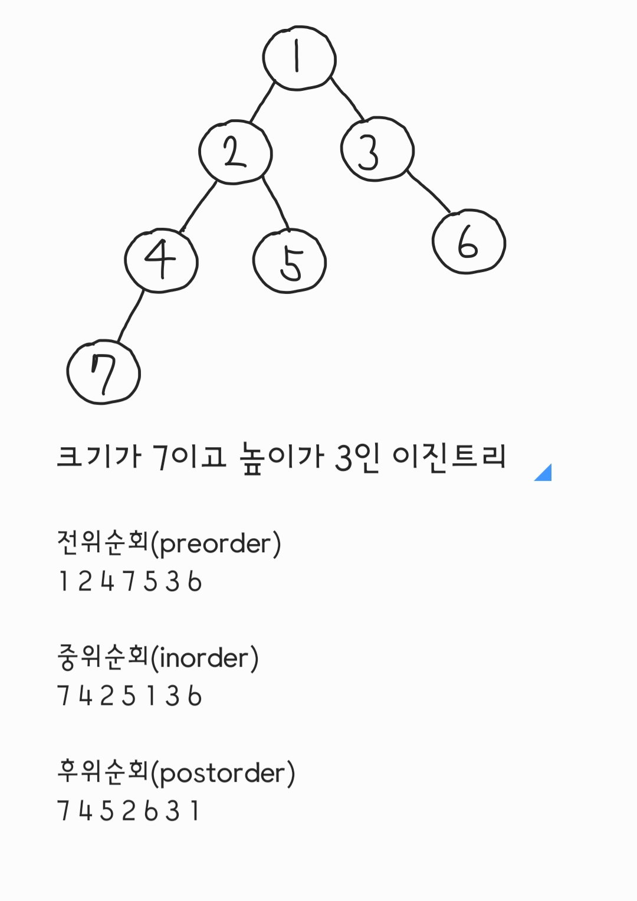

# 이진 트리(기타 이진트리)

- **정렬 여부와 관계 없이** 모든 노드가 둘 이하의 자식을 갖는 단순한 트리 형태의 자료구조

- 트리 자료구조를 활용하여 데이터의 탐색 속도를 증진시키는 자료구조

- 완전이진트리는 배열로 구현을 하지만 완전이진트리나 포화이진트리가 아닌 기타 이진트리의 경우 배열로 구현하게 되면 메모리의 낭비가 발생할 수 있기 때문에 포인터를 사용한다.

- 전위순회, 중위순회, 후위순회 방식이 있고(레벨순회 방식도 있음), 재귀적으로 구현할 수 있다.

    

하나의 노드를 방문했을 때

- 전위순회

  1. 자기 자신을 처리한다.
  2. 왼쪽 노드를 방문한다.
  3. 오른쪽 노드를 방문한다.

- 중위순회

  1. 왼쪽 노드를 방문한다.
  2. 자기 자신을 처리한다.
  3. 오른쪽 노드를 방문한다.

- 후위순회
  1. 왼쪽 노드를 방문한다.
  2. 오른쪽 노드를 방문한다.
  3. 자기 자신을 처리한다.

## C

```c
# include <iostream>

using namespace std;

int number = 7;

// def node
typedef struct node *treePointer;
typedef struct node {
	int data;
	treePointer leftChild, rightChild;
} node;

void preorder(treePointer ptr){
	if(ptr){
		cout << ptr->data << " ";
		preorder(ptr->leftChild);
		preorder(ptr->rightChild);
	}
}

void inorder(treePointer ptr){
	if(ptr){
		inorder(ptr->leftChild);
		cout << ptr->data << " ";
		inorder(ptr->rightChild);
	}
}

void postorder(treePointer ptr){
	if(ptr){
		postorder(ptr->leftChild);
		postorder(ptr->rightChild);
		cout << ptr->data << " ";
	}
}

int main(void){
	node nodes[number + 1];
	// create node
	for(int i=1; i<=number; i++){
		nodes[i].data = i;
		nodes[i].leftChild = NULL;
		nodes[i].rightChild = NULL;
	}

	// link node
	nodes[1].leftChild = &nodes[2];
	nodes[1].rightChild = &nodes[3];
	nodes[2].leftChild = &nodes[4];
	nodes[2].rightChild = &nodes[5];
	nodes[4].leftChild = &nodes[7];
	nodes[3].rightChild = &nodes[6];

	// order
	preorder(&nodes[1]);
	// 1 2 4 7 5 3 6
	printf("\n");
	inorder(&nodes[1]);
	// 7 4 2 5 1 3 6
	printf("\n");
	postorder(&nodes[1]);
	// 7 4 5 2 6 3 1
	return 0;
}

```
