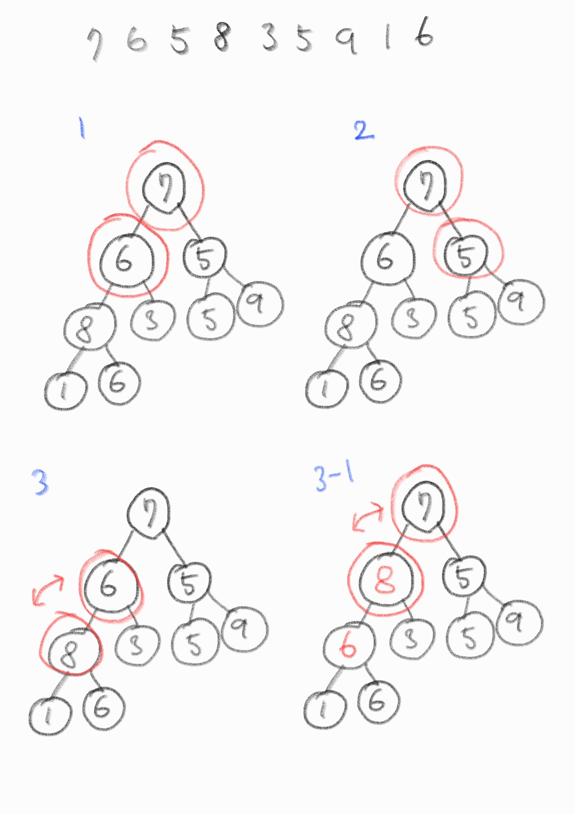
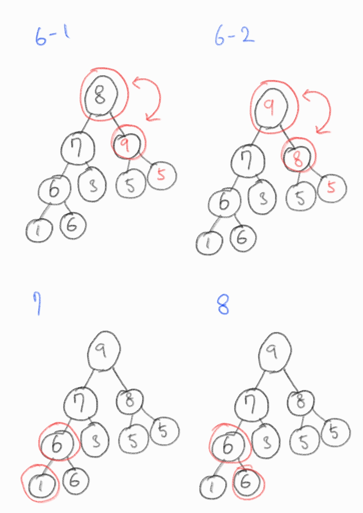

# 힙(heap)

- 1964년 J.W.J. 윌리엄스(영국)가 힙 정렬을 고안해내며 설계한 자료구조

- 완전이진트리 형태로 구현하고, 배열로 구현한다.

- 힙의 특성(최소 힙, 최대 힙)을 만족해야 함.

  - 최소 힙 : 부모가 항상 자식보다 작거나 같다.
  - 최대 힙 : 부모가 항상 자식보다 크거나 같다.

- 따라서 배열의 최대, 최소 값을 찾는 것에 목적을 둔다.

- 따라서 "우선순위 큐" 구현을 위한 자료구조(결국 배열로 구현하는 셈.)

- 힙을 구현했다고 하여 "정렬"된 것은 아니다.

**👇 최대 힙**

<a href="https://ko.wikipedia.org/wiki/%ED%9E%99_(%EC%9E%90%EB%A3%8C_%EA%B5%AC%EC%A1%B0)">
</a>

- 따라서 부모 노드와 자식 노드 간에 규칙(index)이 존재하고, 이러한 규칙 덕분에 힙은 효율적인 자료구조라고 할 수 있음.

- 시간복잡도 : O(logN)

---

## heapify (배열을 힙으로 구현)

`7 6 5 8 3 5 9 1 6` 을 최대 "최대 힙"으로 구현





O(N)의 시간복잡도

```c
#include <stdio.h>

int number = 9;
int heap[9] = {7, 6, 5, 8, 3, 5, 9, 1, 6};

int main(void){
	for(int i=1; i<number; i++){
		int c = i;
		do {
			int root = (c - 1) / 2;
			if(heap[root] < heap[c]){
				int temp = heap[root];
				heap[root] = heap[c];
				heap[c] = temp;
			}
			c = root;
		}while(c != 0);
	}

	for(int i=0; i<number; i++){
		printf("%d", heap[i]);
	}
}

// 9 7 8 6 3 5 5 1 6
```

## python의 heapq 모듈 예제

다음 정렬되지 않은 배열에서 k번째로 큰 요소를 추출하라.

```
nums = [3,2,3,1,2,4,5,5,6]
k = 4
```

### 1. heapq 모듈을 이용해서 heap에 모두 푸시한 후 k번째 요소 추출

```python
import heapq
def findKthLargest(nums:list[int], k:int)->int:
    heap = []
    for n in nums:
        # heapq 모듈은 최소힙만 지원하기 때문에 최대힙 구성을 위해 음수로 표현
        heapq.heappush(heap, -n)

    for _ in range(1, k):
        heapq.heappop(heap)

    return -heapq.heappop(heap)

print(findKthLargest(nums, k)) # 4
```

### 2. heapq 모듈의 heapify

배열에서 하나씩 꺼내어 `heapq.heappush()`를 하지 않고도 리스트를 heap으로 만든다. (값을 추가하면 힙 특성이 깨짐, pop만 가능)

```python
import heapq
def findKthLargest(nums:list[int], k:int)->int:
    heapq.heapify(nums)

    # 최대힙 이므로
    for _ in range(len(nums) - k):
        heapq.heappop(nums)

    return heapq.heappop(nums)

print(findKthLargest(nums, k)) # 4
```

### 3. heapq 모듈의 nlargest

가장 큰 값부터 n개의 데이터를 리스트로 반환

```python
import heapq
def findKthLargest(nums:list[int], k:int)->int:
    return heapq.nlargest(k, nums)

print(findKthLargest(nums, k)) # [6, 5, 5, 4]
```
