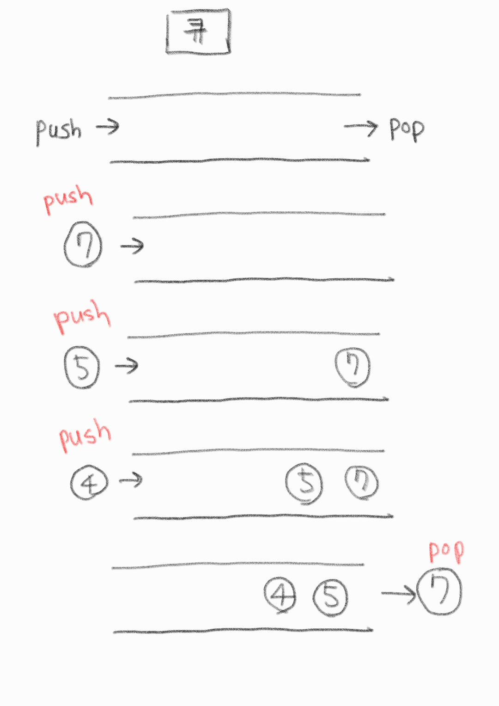

# 큐(Queue)

기본적으로 FIFO(First In First Out) 정책에 기반한 배열 형태의 자료구조



---

# C (C++ STL)

```c
#include <iostream>
#include <queue>

using namespace std;

int main(void){
    queue<int> q;
    q.push(7);
    q.push(5);
    q.push(4);
    q.pop();
    q.push(6);
    q.pop();
    while(!q.empty()){
        cout << q.front() << " ";
        q.pop();
    }
    return 0;
    // 4 6
}

```

---

# Python

python의 리스트는 동적배열이기 때문에 `pop(0)`으로 맨 앞의 요소를 꺼내게 되면 모든 원소를 한 칸씩 앞으로 이동시켜 O(n)의 시간복잡도를 요구한다.

```python
class Queue:
    def __init__(self):
        self.q = []

    def push(self, item):
        self.q.append(item)

    def pop(self):
        if len(self.q) == 0:
            print("queue is empty")
        else:
            return self.q.pop(0)

q = Queue()
for i in range(1, 5):
    q.push(i)

print(q.pop())
# 1
print(q.pop())
# 2
```

## deque

따라서 python에서는 파이썬 표준 라이브러리의 `deque`를 이용하는 것이 좋음.

```python
import collections

class Queue:
    def __init__(self):
        self.q = collections.deque()

    def push(self, item):
        self.q.append(item)

    def pop(self):
        if len(self.q) == 0:
            print("queue is empty")
        else:
            return self.q.popleft()

q = Queue()
for i in range(1, 5):
    q.push(i)

print(q.pop())
# 1
print(q.pop())
# 2
```

# 원형 큐

원형 큐를 구현할 때는 size를 명시해주어야 한다.

```python
class CircularQueue:
    def __init__(self, k:int):
        self.q = [None] * k
        self.maxlen = k
        self.p1 = 0
        self.p2 = 0

    # rear 포인터 이동
    def enQueue(self, value:int)->bool:
        if self.q[self.p2] is None:
            self.q[self.p2] = value
            self.p2 = (self.p2 + 1) % self.maxlen
            return True
        else:
            return False

    # front 포인터 이동
    def deQueue(self)->int:
        if self.q[self.p1] is None:
            return -1
        else:
            x = self.q[self.p1]
            self.q[self.p1] = None
            self.p1 = (self.p1 + 1) % self.maxlen
            return x

    def Front(self)->int:
        return -1 if self.q[self.p1] is None else self.q[self.p1]

    def Rear(self)->int:
        return -1 if self.q[self.p2 - 1] is None else self.q[self.p2 - 1]

    def isEmpty(self)->bool:
        return self.p1 == self.p2 and self.q[self.p1] is None

    def isFull(self)->bool:
        return self.p1 == self.p2 and self.q[self.p1] is not None

cq = CircularQueue(5)

for i in range(6):
    print(cq.enQueue(i))

"""
True
True
True
True
True
False
"""

while not cq.isEmpty():
    print(cq.deQueue())

"""
0
1
2
3
4
"""
```
