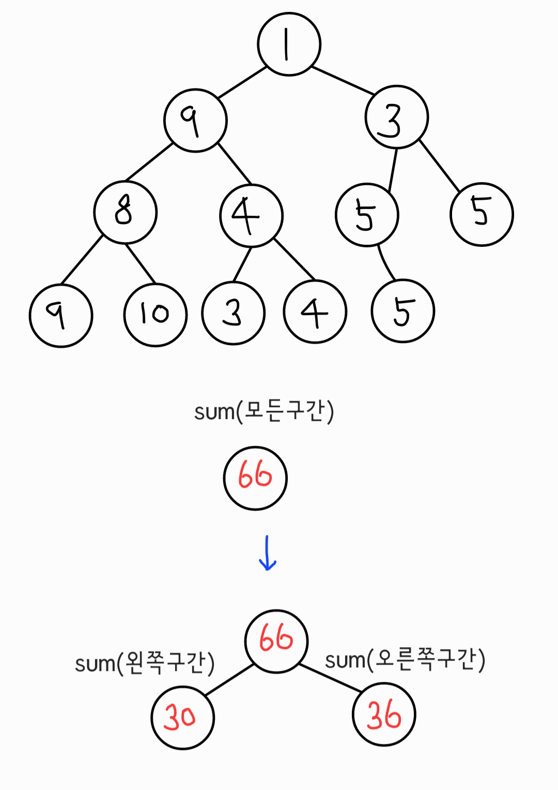
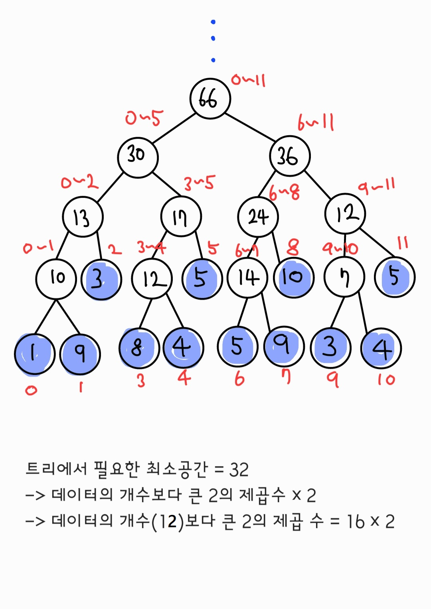

# Segment Tree

- 여러 개의 데이터가 연속적으로 존재할 때 특정한 범위의 데이터 합을 구하는 방법에서 유용

- 데이터의 개수보다 많은 양의 메모리공간을 필요로 한다.

**ex**

> 배열 [1, 9, 3, 8, 4, 5, 5, 9, 10, 3, 4, 5] 에서 index a부터 b 까지 합을 선형적으로 구하려한다면 O(N)의 시간복잡도

어떻게 빠르게 구해야 할까? 👉 Tree구조를 이용




## python

```python
a = [1, 9, 3, 8, 4, 5, 5, 9, 10, 3, 4, 5]
n = len(a)
#1. 구간 합 트리 생성
# 4를 곱하면 모든 범위를 커버할 수 있음
tree = [0] * (4 * n)
# start:시작인덱스, end:끝 인덱스
def init(start:int, end:int, node:int)->int:
    if start == end:
        tree[node] = a[start]
        return tree[node]
    mid = (start + end) // 2
    tree[node] = init(start, mid, node * 2) + init(mid + 1, end, node * 2 + 1)
    return tree[node]

#2. 구간 합을 구하는 함수 만들기
#left, right: 구간 합을 구하고자 하는 범위
def sum(start:int, end:int, node:int, left:int, right:int)->int:
    #범위 밖에 있는 경우
    if left > end or right < start:
        return 0
    #범위 안에 있는 경우
    if left <= start and end <= right:
        return tree[node]
    #그렇지 않다면 두 부분으로 나누어 합을 구하기
    mid = (start + end) // 2
    res = sum(start, mid, node * 2, left, right) + sum(mid + 1, end, node * 2 + 1, left, right)
    return res

#3. 특정 원소 값을 수정하는 함수
def update(start:int, end:int, node:int, index:int, dif:int):
    #범위 밖에 있는 경우
    if index < start or index > end:
        return
    #범위 안에 있으면 내려가며 다른 원소도 갱신
    tree[node] += dif
    if start == end:
        return
    mid = (start + end) // 2
    update(start, mid, node * 2, index, dif)
    update(mid + 1, end, node * 2 + 1, index, dif)


init(0, n - 1, 1)
print(tree)
# [0, 66, 30, 36, 13, 17, 24, 12, 10, 3, 12, 5, 14, 10, 7, 5, 1, 9, 0, 0, 8, 4, 0, 0, 5, 9, 0, 0, 3, 4, 0, 0, 0, 0, 0, 0, 0, 0, 0, 0, 0, 0, 0, 0, 0, 0, 0, 0]
print(f"index 0부터 12까지의 합: {sum(0, n - 1, 1, 0, 12)}") #66
print(f"index 3부터 8까지의 합: {sum(0, n - 1, 1, 3, 8)}") #41
#인덱스 5의 원소를 -5만큼 수정
update(0, n - 1, 1, 5, -5)
print(f"index 0부터 12까지의 합: {sum(0, n - 1, 1, 0, 12)}") #61
print(f"index 3부터 8까지의 합: {sum(0, n - 1, 1, 3, 8)}") #36
```
