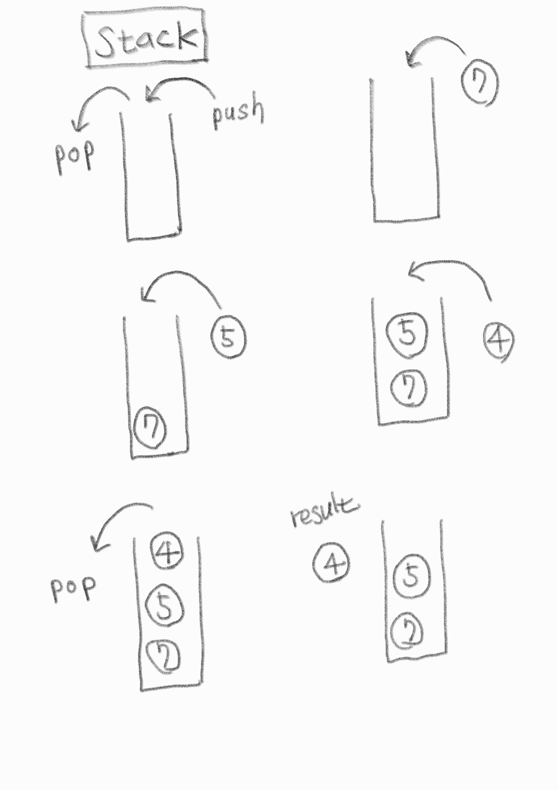

# 스택(Stack)

LIFO(Last In First Out) 정책에 기반한 배열 형태의 자료구조



---

## 재귀적으로 표현한 stack 구조(python)

```python
def recursive(data) :
  if data<0 :
    print("ended")
  else:
    print(data)
    recursive(data-1)
    print("returned", data)

recursive(4)
"""
4
3
2
1
0
ended
returned 0
returned 1
returned 2
returned 3
returned 4
"""
```

---

# C (C++ STL)

```c
#include <iostream>
#include <stack>

using namespace std;

int main(void){
    stack<int> s;
    s.push(7);
    s.push(5);
    s.push(4);
    s.pop();
    s.push(6);
    s.pop();
    while(!s.empty()){
        cout << s.top() << " ";
        s.pop();
    }
    return 0;

// 5 7
}

```

---

# Python

## python 리스트 자료형으로 스택 ADT 구현

```python
class Stack:
    def __init__(self):
        self.list = []

    def push(self, item):
        self.list.append(item)

    def pop(self):
        if len(self.list) == 0:
            print("stack is empty")
        else:
            item = self.list[-1]
            del self.list[-1]
            return item

stack = Stack()
for i in range(1, 5):
    stack.push(i)

print(stack.pop())
# 4
```

## 연결리스트를 이용한 스택 ADT 구현

```python
class Node:
  def __init__(self, item, next):
    self.item = item
    self.next = next

class Stack:
  def __init__(self):
    self.last = None

  def push(self, item):
    self.last = Node(item, self.last)

  def pop(self):
    item = self.last.item
    self.last = self.last.next
    return item
```
