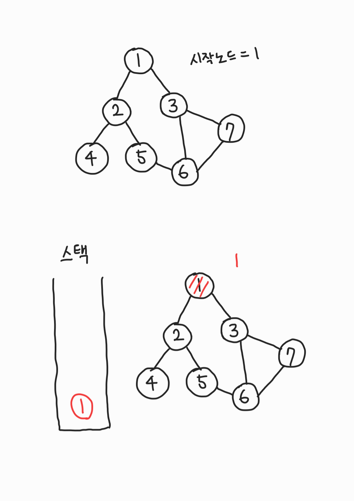
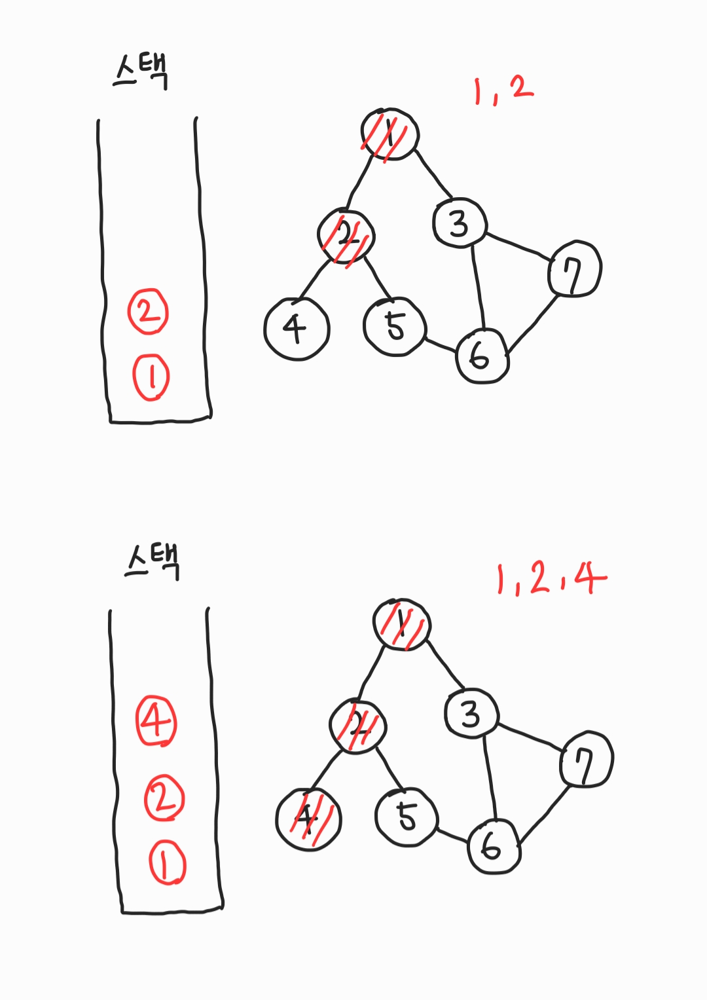
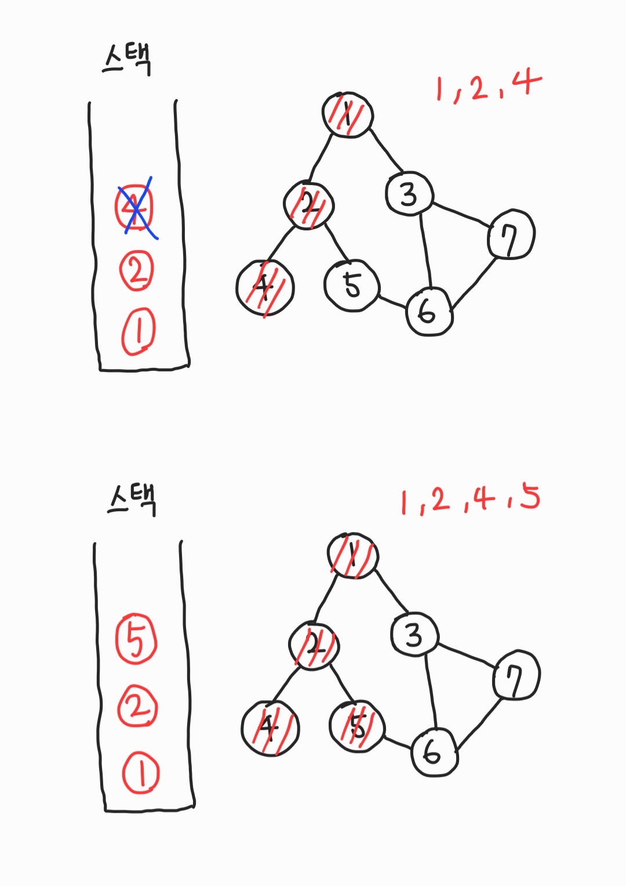
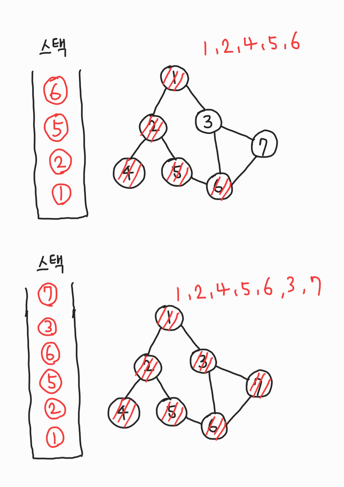
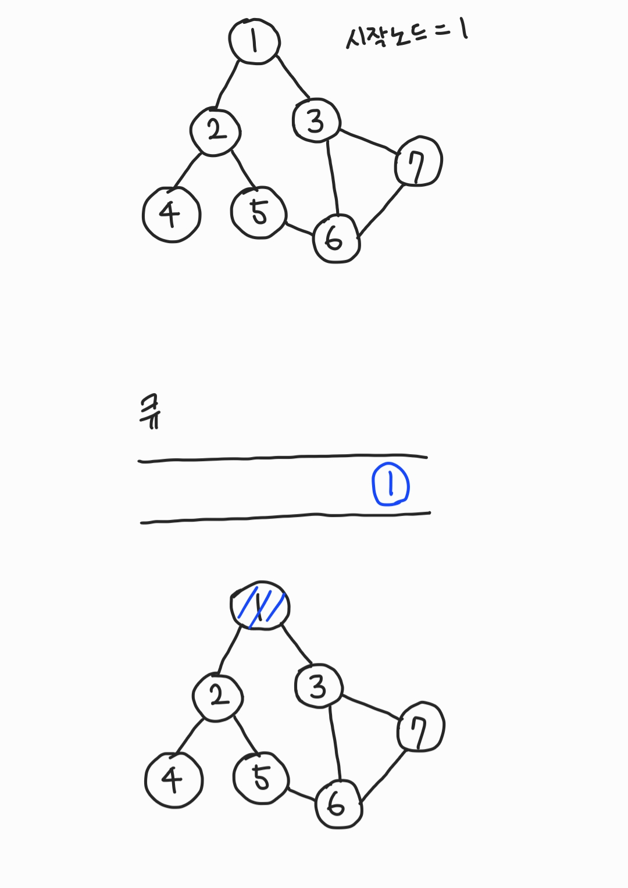
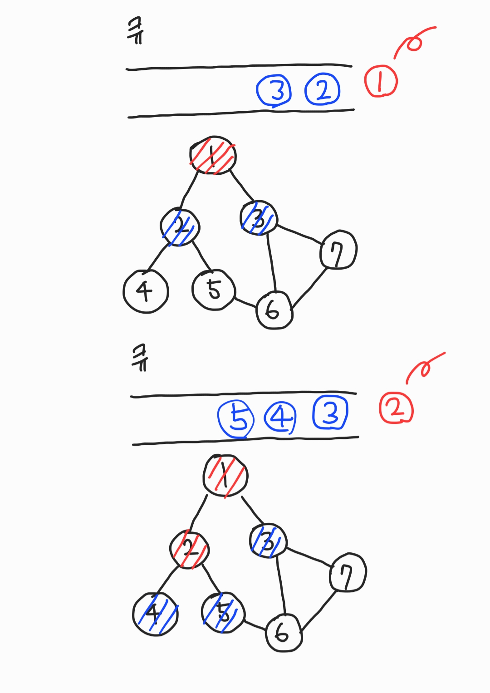
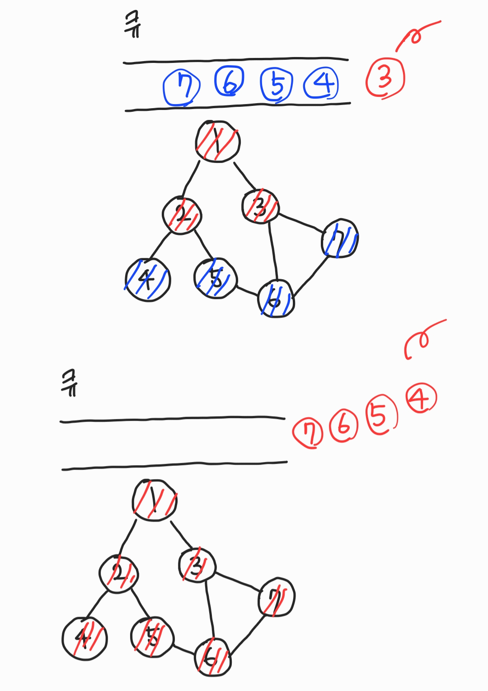

# DFS

그래프와 스택 또는 재귀로 구현한다.






```c
#include <iostream>
#include <vector>

using namespace std;

int number = 7;
int c[8];
vector <int> a[8];

void dfs(int x){
	if(c[x]) return;
	c[x] = true;
	cout << x << " ";
	for(int i=0; i < a[x].size(); i++){
		int y = a[x][i];
		dfs(y);
	}
}

int main(void){
	// 1-2
	a[1].push_back(2);
	a[2].push_back(1);

	// 1-3
	a[1].push_back(3);
	a[3].push_back(1);

	// 2-4
	a[2].push_back(4);
	a[4].push_back(2);

	// 2-5
	a[2].push_back(5);
	a[5].push_back(2);

	// 3-6
	a[3].push_back(6);
	a[6].push_back(3);

	// 3-7
	a[3].push_back(7);
	a[7].push_back(3);

	// 5-6
	a[5].push_back(6);
	a[6].push_back(5);

	// 6-7
	a[6].push_back(7);
	a[7].push_back(6);

	dfs(1);
	return 0;
}

// 1 2 4 5 6 3 7
```

# BFS(Breath First Search, 너비우선탐색)

그래프와 Queue로 구현한다.





```c
#include <iostream>
#include <queue>
#include <vector>

using namespace std;

int number = 7;
//check visit
int c[8];
vector<int> a[8];

void bfs(int start){
	queue<int> q;
	q.push(start);
	c[start] = true;
	while(!q.empty()){
		int x = q.front();
		q.pop();
		printf("%d ", x);
		for(int i=0; i < a[x].size(); i++){
			int y = a[x][i];
			if(!c[y]){
				q.push(y);
				c[y] = true;
			}
		}
	}
}

int main(void){
	// 1-2
	a[1].push_back(2);
	a[2].push_back(1);

	// 1-3
	a[1].push_back(3);
	a[3].push_back(1);

	// 2-4
	a[2].push_back(4);
	a[4].push_back(2);

	// 2-5
	a[2].push_back(5);
	a[5].push_back(2);

	// 3-6
	a[3].push_back(6);
	a[6].push_back(3);

	// 3-7
	a[3].push_back(7);
	a[7].push_back(3);

	// 5-6
	a[5].push_back(6);
	a[6].push_back(5);

	// 6-7
	a[6].push_back(7);
	a[7].push_back(6);

	bfs(1);
	return 0;
}

// 1 2 3 4 5 6 7
```
