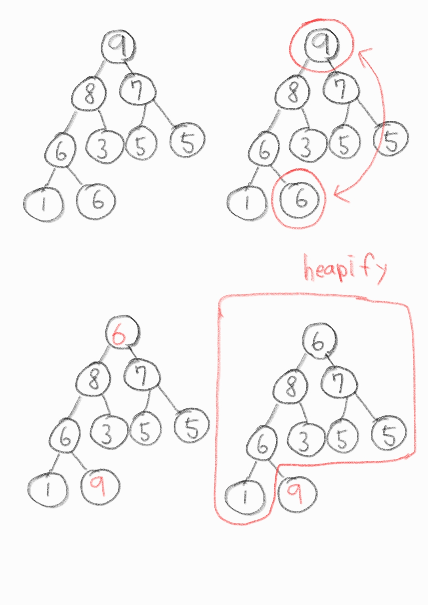

# 정렬 알고리즘

- <a href="#sort-selection">선택 정렬</a>
- <a href="#sort-bubble">버블 정렬</a>
- <a href="#sort-insertion">삽입 정렬</a>
- <a href="#sort-quick">퀵 정렬</a>
- <a href="#sort-merge"> 병합 정렬</a>
- <a href="#sort-heap">힙 정렬</a>
- <a href="#sort-counting">계수 정렬</a>

---

일반적으로 알고리즘을 공부할 때 가장 먼저 풀어보는 문제, 여러가지 방법(알고리즘)들이 있고 효율성 차이가 극명하게 보이기 때문.

> 다음 숫자들을 오름차순으로 정렬하시오... </br>`1 10 5 8 7 6 4 3 2 9`

---

<h2 id="sort-selection">선택 정렬</h2>

> "가장 작은 것을 맨 앞으로 보내면 어떨까?"

`✔1 10 5 8 7 6 4 3 2 9` : 배열을 한번 순회하고 보니 현재 값(1)이 제일 작으므로 그냥 둔다.

`1 ✔2 5 8 7 6 4 3 ✔10 9` : 배열을 한번 순회하고 보니 2가 제일 작으므로 현재 값(10)과 자리를 교체한다.

`1 2 ✔3 8 7 6 4 ✔5 10 9` : 마찬가지로 반복...

`1 2 3 ✔4 7 6 ✔8 5 10 9` . . .

```c++
#include <stdio.h>

int main(void){
	int i, j, min, index, temp;
	int array[10] = {1, 10, 5, 8, 7, 6, 4, 3, 2, 9};
	for(i=0; i<10; i++){
		//충분히 큰 값
		min = 9999;
		for(j=i; j<10; j++){
			if(min > array[j]){
				min = array[j];
				index = j;
			}
		}
        //swap
		temp = array[i];
		array[i] = array[index];
		array[index] = temp;
	}

	for(i=0; i<10; i++){
		printf("%d ", array[i]);
	}

	return 0;
}
```

<strong>Big O Notation : N^2</strong>

선택정렬의 경우 배열의 길이 만큼 계속해서 반복문을 수행한다.

이 경우 첫 번째 연산은 10개의 데이터를, 두 번째 연산은 9개의 데이터... `10 + 9 + 8 ... + 1 = N * (N+1)/2`와 같이 등차수열을 이룸.

빅오표기법에 따라 상수항을 제외하면 `N^2`로 최악의 경우 `O(N^2)`의 시간복잡도를 가진다.

---

<h2 id="sort-bubble">버블 정렬</h2>

> 바로 옆에 있는 숫자를 비교하고 교환하자.

`✔1 ✔10 5 8 7 6 4 3 2 9` : 1과 10을 비교하고 1이 더 작으므로 그냥 둔다.

`1 ✔10 ✔5 8 7 6 4 3 2 9` : 10과 5를 비교하고, 10이 더 크므로 교환한다. 👉 `1 ✔5 ✔10 8 7 6 4 3 2 9`

`1 5 ✔10 ✔8 7 6 4 3 2 9` : 10과 8을 비교하고, 10이 더 크므로 교환한다. 👉 `1 5 ✔8 ✔10 7 6 4 3 2 9` ...

`1 5 8 7 6 4 3 2 9 ✔10` : 따라서 마지막에는 가장 큰 숫자 10이 맨 끝에 위치하게 된다.

```c++
#include <stdio.h>

int main(void){

	int i, j, temp;

	int array[10] = {1, 10, 5, 8, 7, 6, 4, 3, 2, 9};

	for(i=0; i<10; i++){
		for(j=0; j<9-i; j++){
			if(array[j] > array[j+1]){
				temp = array[j+1];
				array[j+1] = array[j];
				array[j] = temp;
			}
		}
	}

	for(i=0; i<10; i++){
		printf("%d ", array[i]);
	}

	return 0;
}
```

<strong>Big O Notation : N^2 이지만...</strong>

선택정렬과 마찬가지로 N^2의 시간복잡도를 가지지만 실제로 더 수행시간이 느리고 비효율적인 알고리즘이다.
👉 옆의 숫자를 비교해서 자리를 바꿔주는 연산을 계속해서 수행하기 때문.

---

<h2 id="sort-insertion">삽입 정렬</h2>

> 각 숫자를 "적절한" 위치에 삽입한다면 어떨까?

`✔1 ✔10 5 8 7 6 4 3 2 9` : 1과 10을 비교, 정렬되어있으므로 패스.

`1 ✔10 ✔5 8 7 6 4 3 2 9` : 10과 5를 비교, 스왑 👉 `1 ✔5 ✔10 8 7 6 4 3 2 9` 👉 `✔1 ✔5 10 8 7 6 4 3 2 9` : 1과 5를 비교, 정렬되어있으므로 패스.

`1 5 ✔10 ✔8 7 6 4 3 2 9` : 10과 8을 비교, 스왑 👉 `1 5 ✔8 ✔10 7 6 4 3 2 9` 👉 `1 ✔5 ✔8 10 7 6 4 3 2 9` : 5와 8을 비교, 정렬되어있으므로 패스...

```c++
#include <stdio.h>

int main(void){

	int i, j, temp;

	int array[10] = {1, 10, 5, 8, 7, 6, 4, 3, 2, 9};
	//i의 범위는 배열의 길이 -1
	for(i=0; i<9; i++){
		j = i;
		while(j >= 0 && array[j] > array[j+1]){
			temp = array[j];
			array[j] = array[j+1];
			array[j+1] = temp;
			j--;
		}
	}

	for(i=0; i<10; i++){
		printf("%d ", array[i]);
	}

	return 0;
}
```

<strong>Big O Notation : N^2 이지만...</strong>

마찬가지로 N^2 의 시간복잡도를 가지지만 데이터가 "거의 정렬된" 상태에서 삽입정렬은 뛰어난 성능을 보인다.

---

<h2 id="sort-bubble">버블 정렬</h2>

> 바로 옆에 있는 숫자를 비교하고 교환하자.

`✔1 ✔10 5 8 7 6 4 3 2 9` : 1과 10을 비교하고 1이 더 작으므로 그냥 둔다.

`1 ✔10 ✔5 8 7 6 4 3 2 9` : 10과 5를 비교하고, 10이 더 크므로 교환한다. 👉 `1 ✔5 ✔10 8 7 6 4 3 2 9`

`1 5 ✔10 ✔8 7 6 4 3 2 9` : 10과 8을 비교하고, 10이 더 크므로 교환한다. 👉 `1 5 ✔8 ✔10 7 6 4 3 2 9` ...

`1 5 8 7 6 4 3 2 9 ✔10` : 따라서 마지막에는 가장 큰 숫자 10이 맨 끝에 위치하게 된다.

```c++
#include <stdio.h>

int main(void){

	int i, j, temp;

	int array[10] = {1, 10, 5, 8, 7, 6, 4, 3, 2, 9};

	for(i=0; i<10; i++){
		for(j=0; j<9-i; j++){
			if(array[j] > array[j+1]){
				temp = array[j+1];
				array[j+1] = array[j];
				array[j] = temp;
			}
		}
	}

	for(i=0; i<10; i++){
		printf("%d ", array[i]);
	}

	return 0;
}
```

<strong>Big O Notation : N^2 이지만...</strong>

선택정렬과 마찬가지로 N^2의 시간복잡도를 가지지만 실제로 더 수행시간이 느리고 비효율적인 알고리즘이다.
👉 옆의 숫자를 비교해서 자리를 바꿔주는 연산을 계속해서 수행하기 때문.

---

<h2 id="sort-quick">퀵 정렬</h2>

> 피벗을 기준으로 두 부분으로 나눈다(분할과 정복 + 재귀)

(1) 첫 번째 숫자를 피벗으로 설정한다.

(2) 앞에서부터 피벗보다 큰 숫자를 찾는다, 뒤에서 부터 피벗보다 작은 숫자를 찾는다.

(3-1) 엇갈리지 않는다면 두 숫자를 swap하고 다시 2번을 수행한다.

(3-2) 엇갈린다면 피벗과 작은 숫자를 swap하고 피벗을 기준으로 분할한다.

`3 8 6 2 10 5 1 4 7 9`

`(3) 8 6 2 10 5 1 4 7 9` : (1)

`(3) 👉8 6 2 10 5 1👈 4 7 9` : (2) 엇갈리지 않음

`(3) ✔1 6 2 10 5 ✔8 4 7 9` : (3-1)

`(3) 1 👉6 2👈 10 5 8 4 7 9` : (2) 엇갈리지 않음

`(3) 1 ✔2 ✔6 10 5 8 4 7 9` : (3-1)

`(3) 1 2👈 👉6 10 5 8 4 7 9` : (2) 엇갈림

`✔2 1 ✔(3) 6 10 5 8 4 7 9` : (3-2)

`(2) 1 /--3--/ (6) 10 5 8 4 7 9` : (1) 3을 기준으로 분할

```c++
#include <stdio.h>

int number = 10;
int data[] = {3, 8, 6, 2, 10, 5, 1, 4, 7, 9};

//start : 시작 index
//end : 끝 index
void quickSort(int* data, int start, int end){
	//원소가 1개인 경우
	if(start >= end){
		return;
	}

	int key, i, j, temp;

	key = start;
	i = start + 1;
	j = end;

	//엇갈릴 때까지
	while(i <= j){
		while(i <= end && data[i] <= data[key]){
			i++;
		}
		while(j > start && data[j] >= data[key] ){
			j--;
		}
		//엇갈리지 않으면
		if(i < j){
			temp = data[i];
			data[i] = data[j];
			data[j] = temp;
		} else {
			temp = data[j];
			data[j] = data[key];
			data[key] = temp;
		}
	}

	quickSort(data, start, j-1);
	quickSort(data, j+1, end);
}

int main(void){
	quickSort(data, 0, number-1);

	for(int i=0; i<number; i++){
		printf("%d ", data[i]);
	}

	return 0;
}
```

<strong>Big O Notation : N \* log(N)</strong>

계속해서 절반으로 쪼개기 때문에 "일반적인 경우" 효율적인 알고리즘이지만, 최악의 경우, 예를 들어 데이터가 "거의 정렬된 상태"라면 N\*N 의 시간복잡도를 보여준다.("거의 정렬된 상태"에서는 삽입정렬이 더 뛰어날 수 있다.)

---

<h2 id="sort-merge">병합 정렬</h2>

> "일단" 반으로 나누고 나중에 합치자 (분할과 정복 + 재귀)

`7 6 5 8 3 5 9 1`

👉 분할, 일단 계속해서 반으로 나눈다.

`7 6 5 8 / 3 5 9 1`

`7 6 / 5 8 / 3 5 / 9 1`

`7 / 6 / 5 / 8 / 3 / 5 / 9 / 1` 👉 더 이상 나눌 수 없음

👉 병합

`6 7 / 5 8 / 3 5 / 1 9`

`5 6 7 8 / 1 3 5 9`

`1 3 5 5 6 7 8 9`

```c++
#include <stdio.h>

// 배열의 길이
int number = 8;
// 정렬배열은 반드시 전역변수로 선언
int sorted[8];

void merge(int a[], int m, int middle, int n){

	//index
	int i = m;
	int j = middle + 1;
	int k = m;

	while(i <= middle && j <= n){
		if(a[i] <= a[j]){
			sorted[k] = a[i];
			i++;
		} else {
			sorted[k] = a[j];
			j++;
		}
		k++;
	}
	if(i > middle){
		for(int t=j; t<=n; t++){
			sorted[k] = a[t];
			k++;
		}
	} else{
		for(int t=i; t<=middle; t++){
			sorted[k] = a[t];
			k++;
		}
	}
	for(int t=m; t<=n; t++){
		a[t] = sorted[t];
		printf("%d ", a[t]);
	}
	printf("\n");
}

void mergeSort(int a[], int m, int n){
	if(m < n){
		int middle = (m + n) / 2;
		mergeSort(a, m, middle);
		mergeSort(a, middle+1, n);
		merge(a, m, middle, n);
	}
}

int main(void){
	int array[number] = {7,6,5,8,3,5,9,1};
	mergeSort(array, 0, number-1);
	for(int i=0; i<number; i++){
		printf("%d ", array[i]);
	}
}
```

<strong>Big O Notation : N \* log(N)</strong>

퀵 정렬의 경우 최악에는 N*N의 시간복잡도를 가질 수 있지만 병합정렬은 무조건 반으로 쪼갠 후 연산을 수행하기 때문에 N * log(N)의 시간복잡도를 보장할 수 있다. 하지만 기존의 데이터를 담을 추가적인 메모리 공간을 필요로 하기 때문에 메모리의 낭비가 있을 수 있다.

---

<h2 id="sort-heap">힙 정렬</h2>

> [힙(heap)](https://github.com/ryong9rrr/algorithm-basic-c/tree/master/%EC%9E%90%EB%A3%8C%EA%B5%AC%EC%A1%B0/%ED%9E%99)을 이용해 데이터를 정렬한다.

### 힙 정렬

목적에 맞게 힙을 구현(최소 힙 or 최대 힙)하고 정렬한다.

> 최대 힙을 오름차순으로 정렬하기



...와 같이 계속해서 `root`값을 맨 뒤로 보낸 뒤 나머지 값들에 대해 `heapify`를 수행한다.

```c++
#include <stdio.h>

int number = 9;
int heap[9] = {7, 6, 5, 8, 3, 5, 9, 1, 6};

int main(void){
	// 초기 heapify
	for(int i=1; i<number; i++){
		int c = i;
		do {
			int root = (c - 1) / 2;
			if(heap[root] < heap[c]){
				int temp = heap[root];
				heap[root] = heap[c];
				heap[c] = temp;
			}
			c = root;
		}while(c != 0);
	}

	for(int i=0; i<number; i++){
		printf("%d ", heap[i]);
	}

	printf("\n");

	// heapify 된 배열을 가지고 정렬 수행
	for(int i = number - 1; i >= 0; i--){
		// swap
		int temp = heap[0];
		heap[0] = heap[i];
		heap[i] = temp;
		int root = 0;
		int c;

		//다시 heapify
		do{
			c = root * 2 + 1;
			if(c < i-1 && heap[c] < heap[c+1]){
				c++;
			}
			if(c < i && heap[root] < heap[c]){
				temp = heap[root];
				heap[root] = heap[c];
				heap[c] = temp;
			}
			root = c;
		}while (c < i);
	}

	for(int i=0; i<number; i++){
		printf("%d ", heap[i]);
	}
}
// 9 7 8 6 3 5 5 1 6
// 1 3 5 5 6 6 7 8 9
```

<strong>Big O Notation : O(N \* log(N)) </strong>

배열을 힙 구조로 만드는 시간복잡도 + 힙 정렬을 하는 시간복잡도 = N _ log(N) + N _ log(N) = N \* log(N)

---

<h2 id="sort-counting">계수 정렬</h2>

> 수의 범위가 특정한 경우 갯수를 센다.

- 일반적인 경우보다는 특정한 경우에서 사용할 수 있는 매우 빠른 정렬방법

- 새로운 배열을 만들어두고 "마치 정렬된 것 처럼" 구현

```c++
# include <stdio.h>

int main(void){
	int temp;
	int count[6];
	int array[30] = {1, 3, 2, 4, 3, 2, 5, 3, 1, 2,
					 3, 4, 4, 3, 5, 1, 2, 3, 5, 2,
					 3, 1, 4, 3, 5, 1, 2, 1, 1, 1};
	// counting array init
	for(int i=1; i<=5; i++){
		count[i] = 0;
	}

	// counting
	for(int i=0; i<30; i++){
		count[array[i]]++;
	}

	//result
	for(int i=1; i<=5; i++){
		if(count[i] != 0){
			for(int j=0; j<count[i]; j++){
				printf("%d", i);
			}
		}
	}
	// 111111112222223333333344445555
}
```

<strong>Big O Notation : log(N) </strong>

빠르지만 "범위"에 따른 제약 등 제약사항이 많은 방법.
