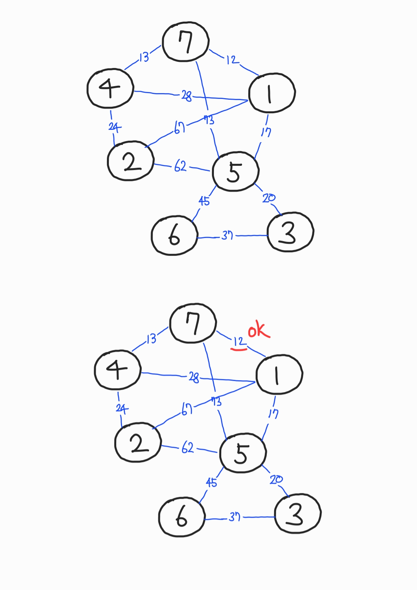
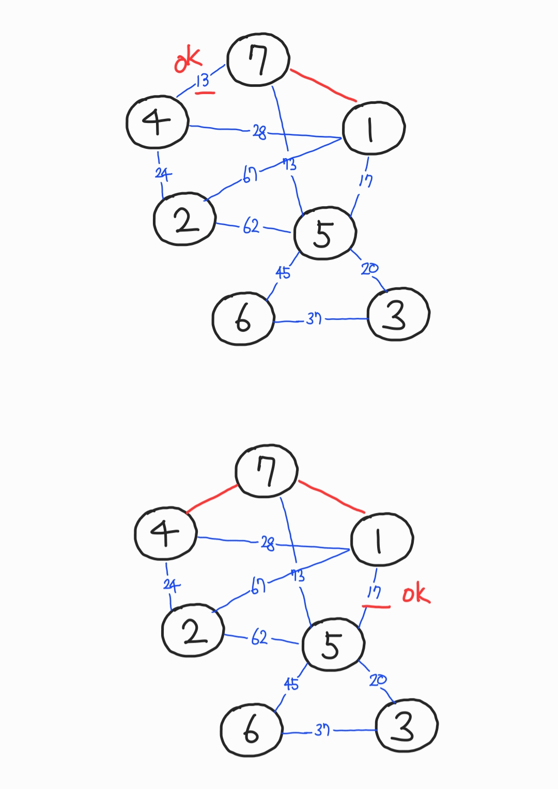
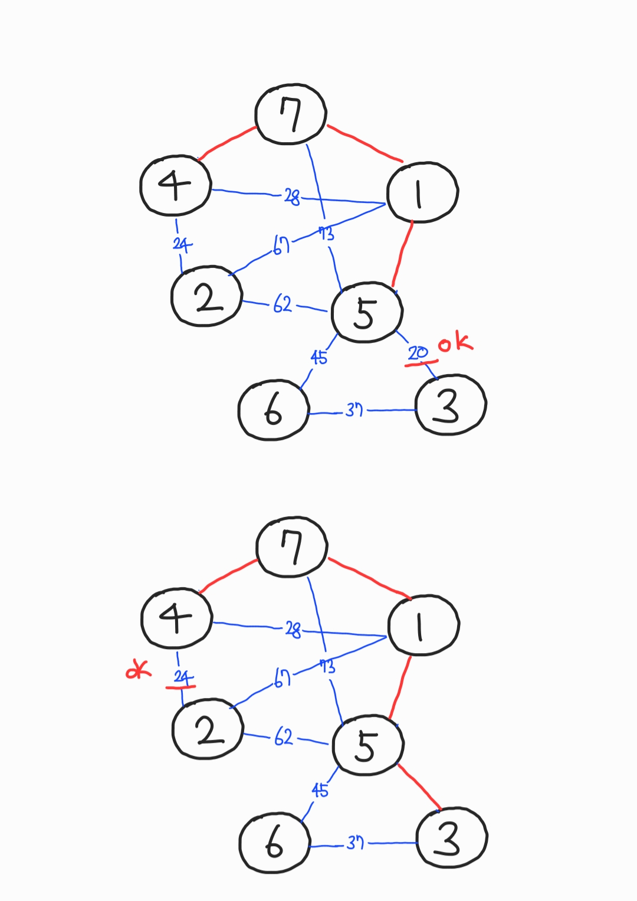
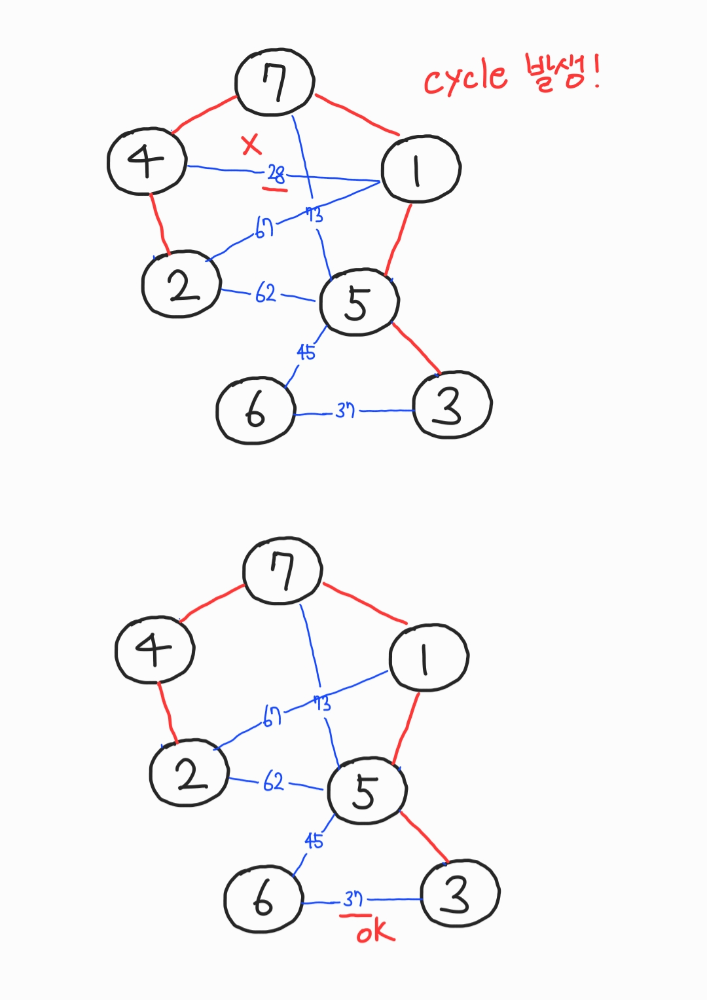
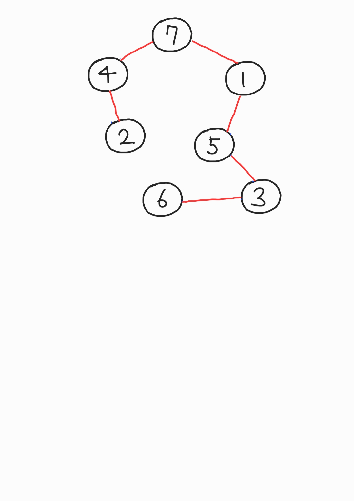

# Kruskal Algorithm

- 가장 적은 "비용"으로 모든 노드를 연결한다.

- **최소비용신장트리**를 만들기 위한 대표적인 알고리즘

- 노드가 n개 일 때, 모든 노드를 연결하는 간선은 n-1개면 충분하다. 따라서 cycle이 발생하지 않도록 한다.

## 알고리즘

1. 간선의 비용이 가장 적은 순서부터 오름차순으로 정렬한다.
2. cycle이 발생하지 않는다면 연결(채택)한다.
3. cycle이 발생한다면 그 간선은 채택하지 않고 건너뛴다.







## C

`Union-Find` 알고리즘을 사용한다.

```c
#include <iostream>
#include <algorithm>
#include <vector>

using namespace std;

int getParent(int set[], int x){
	if(set[x] == x) return x;
	return set[x] = getParent(set, set[x]);
}

void unionParent(int set[], int a, int b){
	a = getParent(set, a);
	b = getParent(set, b);
	if(a<b) set[b] = a;
	else set[a] = b;
}

int find(int set[], int a, int b){
	a = getParent(set, a);
	b = getParent(set, b);
	if (a==b) return 1;
	else return 0;
}

class Edge {
	public:
		int node[2];
		int distance;
		Edge(int a, int b, int distance){
			this->node[0] = a;
			this->node[1] = b;
			this->distance = distance;
		}
	bool operator <(Edge &edge){
		return this->distance < edge.distance;
	}
};

int main(void){
	int n=7;
	int m=11;

	vector<Edge> v;
	v.push_back(Edge(1, 7, 12));
	v.push_back(Edge(1, 4, 28));
	v.push_back(Edge(1, 2, 67));
	v.push_back(Edge(1, 5, 17));
	v.push_back(Edge(2, 4, 24));
	v.push_back(Edge(2, 5, 62));
	v.push_back(Edge(3, 5, 20));
	v.push_back(Edge(3, 6, 37));
	v.push_back(Edge(4, 7, 13));
	v.push_back(Edge(5, 6, 45));
	v.push_back(Edge(5, 7, 73));

	sort(v.begin(), v.end());

	int set[n];
	for(int i=0; i<n; i++){
		set[i] = i;
	}

	int sum=0;
	for(int i=0; i<v.size(); i++){
		if(!find(set, v[i].node[0]-1, v[i].node[1]-1)){
			sum += v[i].distance;
			unionParent(set, v[i].node[0]-1, v[i].node[1]-1);
		}
	}
	printf("%d\n", sum);
	// 123
}
```
