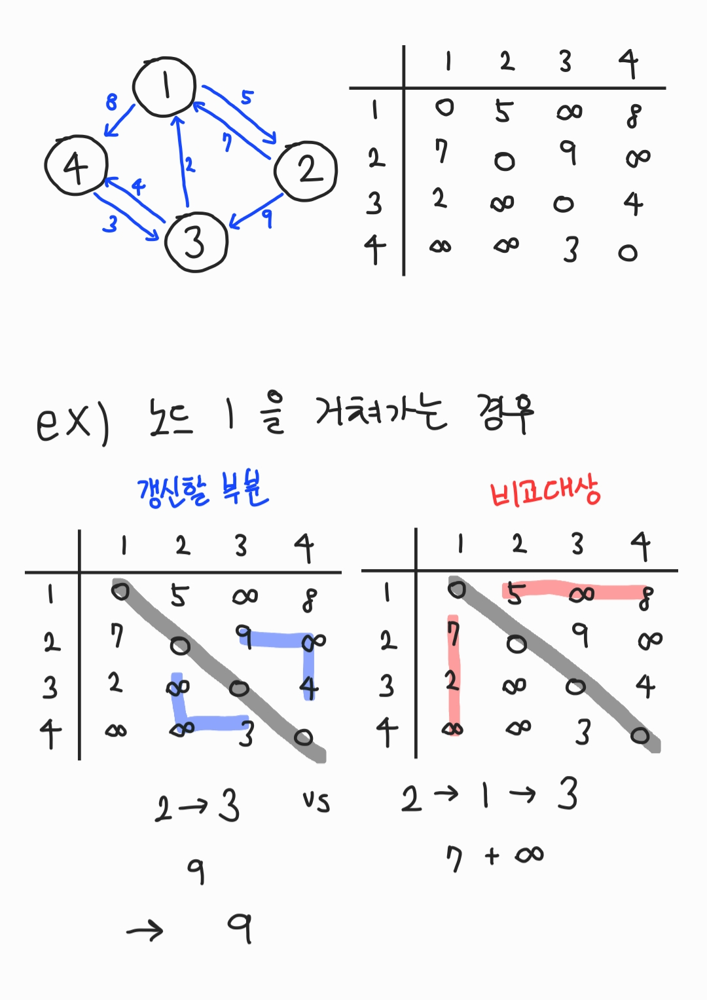
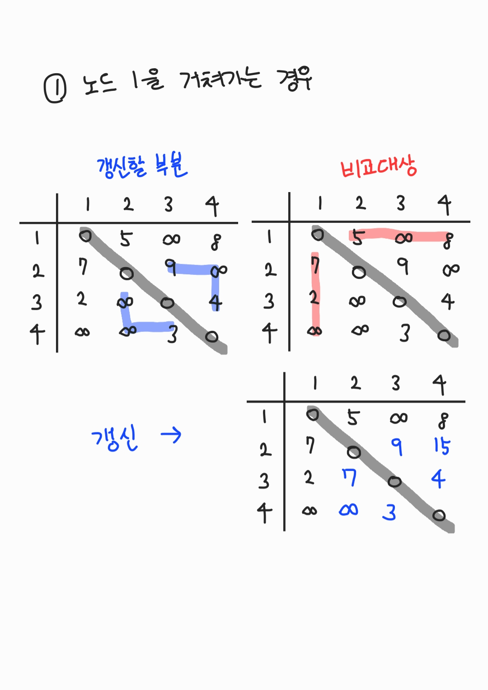
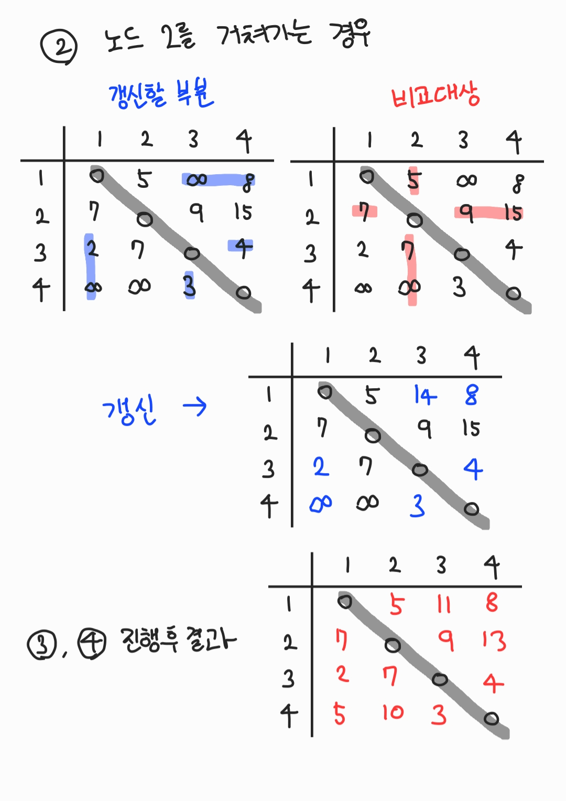

# Floyd Warshall Algorithm

- 경로를 찾는 알고리즘으로 다익스트라 알고리즘과 맥락이 같다.

- 보통 다익스트라 알고리즘은 하나의 노드를 기준으로 경로를 찾기 때문에 1차원 배열로 구현을 하지만 플로이드 와샬 알고리즘은 모든 노드를 기준으로 경로를 찾기 때문에 2차원 배열(행렬)로 구현을 한다.

## 예시





## python

```python
INF = int(1e9)

#node num
n = 4
graph = [
    [],
    [INF, 0, 5, INF, 8],
    [INF, 7, 0, 9, INF],
    [INF, 2, INF, 0, 4],
    [INF, INF, INF, 3, 0]
]

def fw():
    for k in range(1, n+1):
        for a in range(1, n+1):
            for b in range(1, n+1):
                graph[a][b] = min( graph[a][b], graph[a][k]+graph[k][b] )

fw()
for i in range(1, n+1):
    for j in range(1, n+1):
        print(graph[i][j], end=" ")
    print()

"""
0 5 11 8
7 0 9 13
2 7 0 4
5 10 3 0
"""
```
