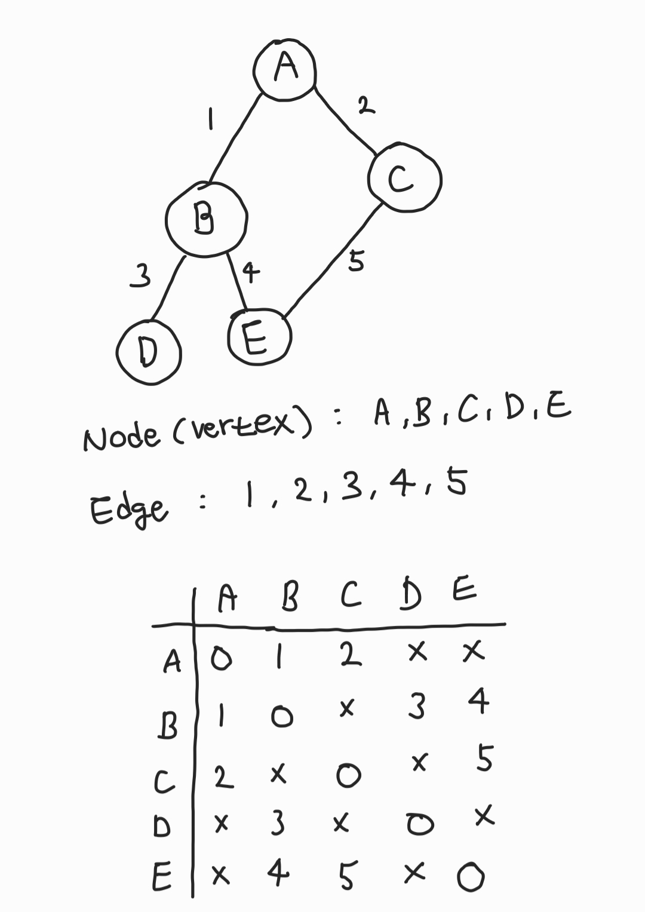
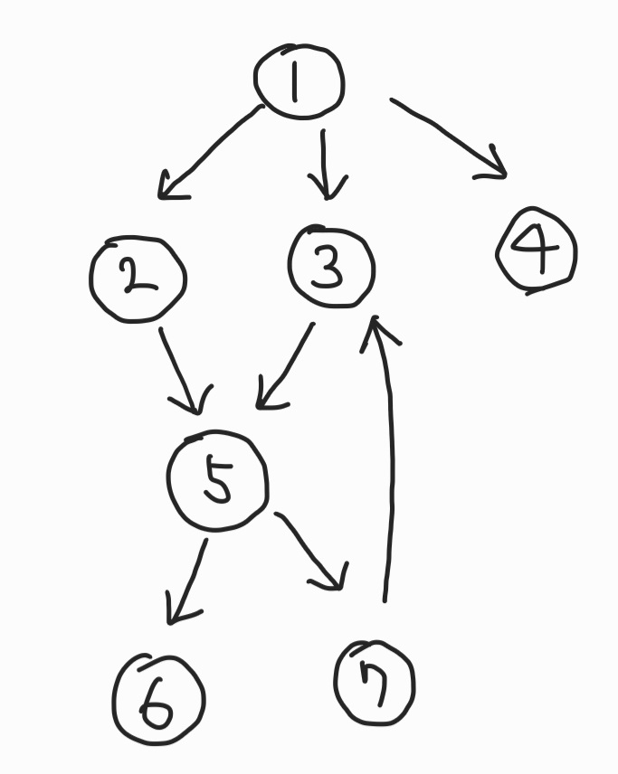

# 그래프(Graph)

- 노드(Node)와 간선(Edge)로 표현된다. Node는 Vertex(정점)이라고도 한다.

- 인접리스트, 딕셔너리, 인접행렬로 표현할 수 있다.

- 간선은 "비용"을 가질 수 있음

- 간선은 "방향"을 가질 수 있음 (유향그래프, 무향그래프)

## 비용이 있는 무향 그래프, 인접행렬, 인접리스트로 표현

- Node도 숫자로 표현하는게 일반적임.



```
인접리스트

graph[A, B, C, D, E] =

[ [(B,1),(C,2)], [(A,1),(D,3),(E,4)], [(A,2),(E,5)], [(B,3)], [(B,4),(C,5)] ]
```

## 비용이 없는 유향 그래프, 딕셔너리



```
graph = {
    1: [2,3,4],
    2: [5],
    3: [5],
    4: [],
    5: [6,7],
    6: [],
    7: [3],
}
```
