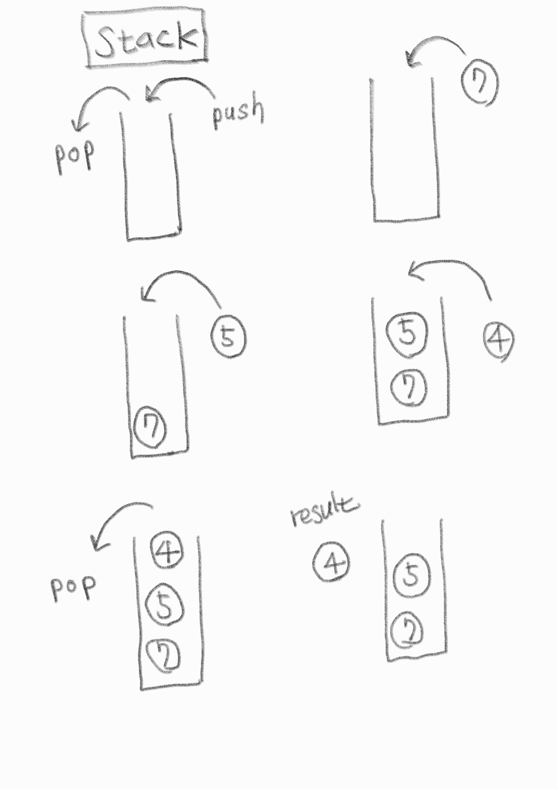

# 스택(Stack)

LIFO(Last In First Out) 정책에 기반한 배열 형태의 자료구조



---

## 재귀적으로 표현한 stack 구조(python)

```python
def recursive(data) :
  if data<0 :
    print("ended")
  else:
    print(data)
    recursive(data-1)
    print("returned", data)

recursive(4)
"""
4
3
2
1
0
ended
returned 0
returned 1
returned 2
returned 3
returned 4
"""
```

---

## C (C++ STL)

```c
#include <iostream>
#include <stack>

using namespace std;

int main(void){
    stack<int> s;
    s.push(7);
    s.push(5);
    s.push(4);
    s.pop();
    s.push(6);
    s.pop();
    while(!s.empty()){
        cout << s.top() << " ";
        s.pop();
    }
    return 0;

// 5 7
}

```

---

## Python

## append(), pop()

내장함수를 이용한 구현,

js의 경우 `push()`, `pop()`

```python
#python
data_stack = []

data_stack.append(1)
data_stack.append(2)
data_stack.append(3)

print(data_stack) # [1,2,3]

print(data_stack.pop()) # 3

print(data_stack) #[1,2]
```

## "push", "pop" 직접 정의

```python
#python
data_stack = []

def push(data) :
  data_stack.append(data)

def pop():
  data = data_stack[-1]
  del data_stack[-1]
  return data

push(1)
push(2)
push(3)

print(data_stack) # [1,2,3]

print(pop()) # 3
print(pop()) # 2

print(data_stack) # [1]

```
