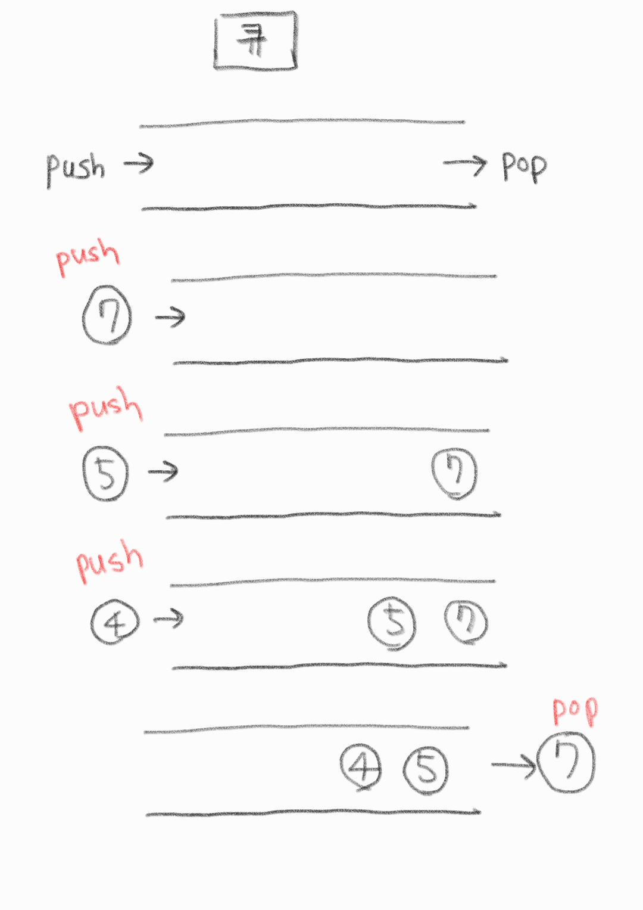

# 큐(Queue)

기본적으로 FIFO(First In First Out) 정책에 기반한 배열 형태의 자료구조



---

# C (C++ STL)

```c
#include <iostream>
#include <queue>

using namespace std;

int main(void){
    queue<int> q;
    q.push(7);
    q.push(5);
    q.push(4);
    q.pop();
    q.push(6);
    q.pop();
    while(!q.empty()){
        cout << q.front() << " ";
        q.pop();
    }
    return 0;
    // 4 6
}

```

---

# Python

## FIFO

```python
import queue

data = queue.Queue()

#enqueue
data.put("hi")
data.put(1)

#size
print(data.qsize())

#dequeue
print(data.get()) #hi
print(data.get()) #1
```

## LIFO (stack)

```python
import queue

data = queue.LifoQueue()

#enqueue
data.put("hi")
data.put(1)

#dequeue
print(data.get()) #1
print(data.get()) #hi
```

## Priority

"튜플" 형태로 값이 입력됨.

```python
import queue

data = queue.PriorityQueue()

data.put((2, "one"))
data.put((3, "two"))
data.put((1, "three"))

print(data.get()) # (1, "three")
print(data.get()) # (2, "one")
print(data.get()) # (3, "two")
```

## 라이브러리 없이 구현

`del`로 배열의 맨 앞의 값을 없애준다.

### FIFO

```python

data_list = []

def enqueue(data) :
  data_list.append(data)

def dequeue():
  data = data_list[0]
  del data_list[0]
  return data

enqueue(1)
enqueue(2)
enqueue(3)

print(data_list)

print(dequeue())

print(data_list)

```

### LIFO

`pop()` 활용.

```python
data_list = []

def enqueue(data) :
  data_list.append(data)

def dequeue():
  return data_list.pop()

enqueue(1)
enqueue(2)
enqueue(3)

print(data_list) # [1,2,3]

print(dequeue()) # 3

print(data_list) # [1,2]
```
