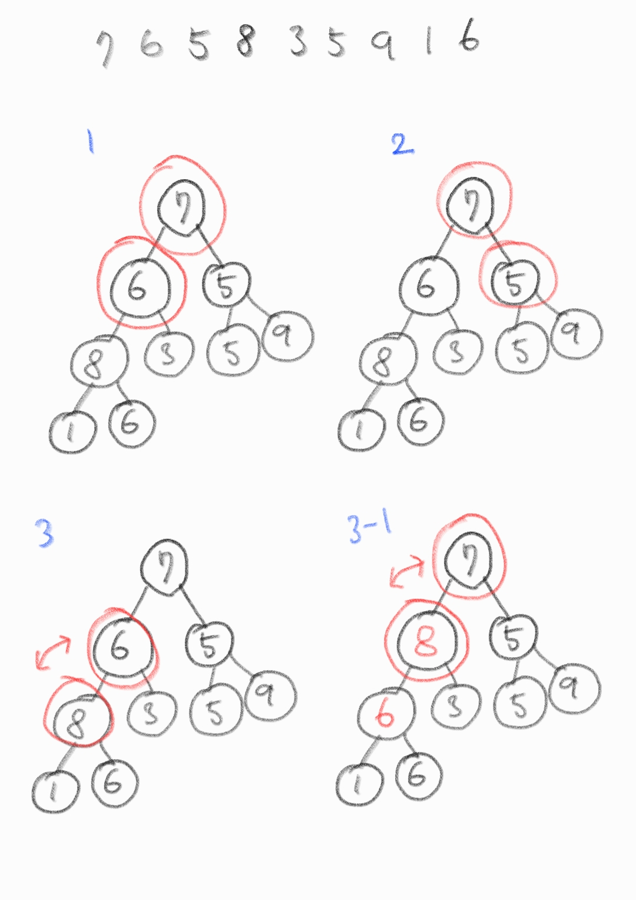
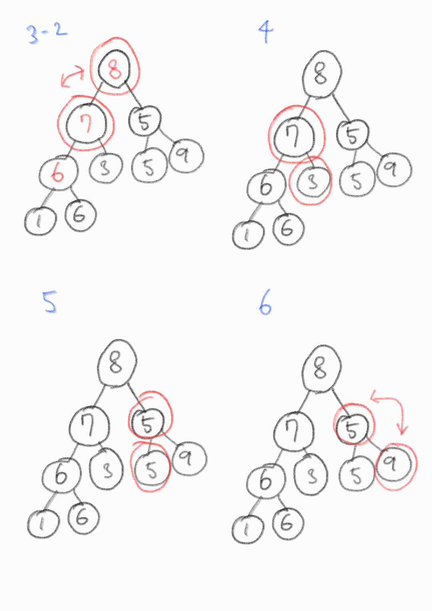
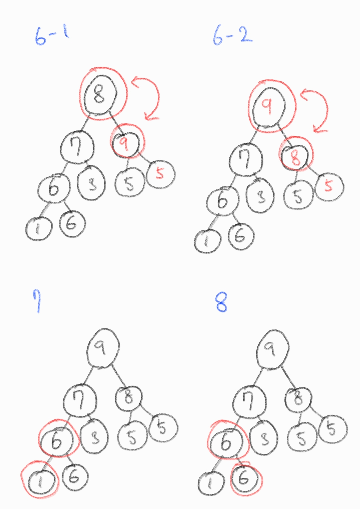

# 힙(heap)

- 1964년 J.W.J. 윌리엄스(영국)가 힙 정렬을 고안해내며 설계한 자료구조

- 완전이진트리 형태로 구현하고, 배열로 구현한다.

- 힙의 특성(최소 힙, 최대 힙)을 만족해야 함.

  - 최소 힙 : 부모가 항상 자식보다 작거나 같다.
  - 최대 힙 : 부모가 항상 자식보다 크거나 같다.

- 따라서 배열의 최대, 최소 값을 찾는 것에 목적을 둔다.

- 따라서 "우선순위 큐" 구현을 위한 자료구조(결국 배열로 구현하는 셈.)

- 힙을 구현했다고 하여 "정렬"된 것은 아니다.

**👇 최대 힙**

<a href="https://ko.wikipedia.org/wiki/%ED%9E%99_(%EC%9E%90%EB%A3%8C_%EA%B5%AC%EC%A1%B0)">
</a>

- 따라서 부모 노드와 자식 노드 간에 규칙(index)이 존재하고, 이러한 규칙 덕분에 힙은 효율적인 자료구조라고 할 수 있음.

- 시간복잡도 : O(logN)

---

## heapify (배열을 힙으로 구현)

`7 6 5 8 3 5 9 1 6` 을 최대 "최대 힙"으로 구현





O(N)의 시간복잡도

```c
#include <stdio.h>

int number = 9;
int heap[9] = {7, 6, 5, 8, 3, 5, 9, 1, 6};

int main(void){
	for(int i=1; i<number; i++){
		int c = i;
		do {
			int root = (c - 1) / 2;
			if(heap[root] < heap[c]){
				int temp = heap[root];
				heap[root] = heap[c];
				heap[c] = temp;
			}
			c = root;
		}while(c != 0);
	}

	for(int i=0; i<number; i++){
		printf("%d", heap[i]);
	}
}

// 9 7 8 6 3 5 5 1 6
```

# python 힙 구현

```python
# heap
class BinaryHeap(object):
    def __init__(self):
        self.items = [None]

    def __len__(self):
        return len(self.items) - 1

    # insert heapify
    def _percolate_up(self):
        i = len(self)
        parent = i // 2
        while parent > 0:
            if self.items[i] < self.items[parent]:
                self.items[parent], self.items[i] = \
                    self.items[i], self.items[parent]
            i = parent
            parent = i // 2

    # insert, this is heapq.heappush()
    def insert(self, k):
        self.items.append(k)
        self._percolate_up()

    # pop heapify
    def _percolate_down(self, idx):
        left = idx * 2
        right = idx * 2 + 1
        smallest = idx

        if left <= len(self) and self.items[left] < self.items[smallest]:
            smallest = left
        if right <= len(self) and self.items[right] < self.items[smallest]:
            smallest = right
        if smallest != idx:
            self.items[idx], self.items[smallest] = \
                self.items[smallest], self.items[idx]
            self._percolate_down(smallest)

    # extract, this is heapq.heappop()
    def extract(self):
        extracted = self.items[1]
        self.items[1] = self.items[len(self)]
        self.items.pop()
        self._percolate_down(1)
        return extracted


numbers = [1, 10, 5, 8, 7, 6, 4, 3, 2, 9]

heap = BinaryHeap()

for number in numbers:
    heap.insert(number)

print(heap.items)
# [None, 1, 2, 4, 3, 8, 6, 5, 10, 7, 9]

for _ in range(len(numbers)):
    print(heap.extract(), end=" ")
# 1 2 3 4 5 6 7 8 9 10
```
